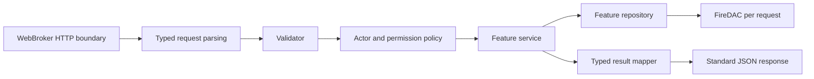

# Review Lengkap DelphiAPIStarterKit — Windows dan Linux

Tanggal review: **1 Oktober 2026, Asia/Jakarta**. Repository: `D:\Github\DelphiAPIStarterKit`, branch `main`, HEAD `358db33b95724f654db00e39fd4f35dc26c0d12c`.

Review memakai **working tree saat ini**, termasuk perubahan lokal yang sudah ada sebelum review. HEAD saja tidak merepresentasikan seluruh source yang diperiksa. Source aplikasi tidak diperbaiki dalam pekerjaan ini; rekomendasi di bawah adalah pekerjaan lanjutan.

**Task per kategori:** [indeks 12 task Windows/Linux](review-tasks-windows-linux-2026-10-01.md). Seluruh 46 temuan mempunyai owner utama, langkah perbaikan, dependensi dan acceptance. Laporan ini tetap baseline lengkap; status task masih BELUM DIMULAI.

**Paket eksekusi:** [empat wave dengan prompt satu shot](waves-windows-linux-2026-10-01.md) untuk task 01–03, 04–06, 07–09 dan 10–12.

**Addendum 1 Oktober 2026 — target Auth:** [kontrak auth-v2](auth-production-contract-2026-10-01.md) dan SQL baseline/sample
telah diperbarui sesudah snapshot review ini. Schema lama dan nomor baris dalam temuan adalah bukti historis;
source Pascal/endpoint belum diperbaiki dalam revisi SQL/dokumen ini. Tidak ada finding yang otomatis ditutup.
Gunakan task/prompt terbaru untuk implementasi dan bedakan SQL target dari runtime/migration acceptance.

## 1. Temuan dan prioritas

**Ada bug keamanan, lifecycle, kontrak JSON, pembacaan data, dan konfigurasi yang perlu diselesaikan sebelum deployment publik.** Struktur modul per fitur sudah baik, tetapi pemusatan konfigurasi, logging, autentikasi/otorisasi, dan tanggung jawab helper belum konsisten.

Label bukti:

- **CONFIRMED**: defect atau ketidaksesuaian langsung terlihat pada source saat ini; sebagian juga direproduksi dengan harness lokal. Label ini tidak berarti seluruh skenario sudah diuji pada server/database nyata.
- **CONTEXT-DEPENDENT**: dampak bergantung pemanggil helper, kebijakan bisnis, reverse proxy, deployment, concurrency, atau integrasi yang belum dijalankan.
- **P0**: perlu ditutup sebelum akses publik karena memungkinkan perubahan/pengambilalihan akun lintas user.
- **P1**: risiko keamanan, crash, kehilangan/kerusakan representasi data, atau kegagalan inti aplikasi yang tinggi.
- **P2**: defect correctness, reliability, deployment, atau kontrak yang penting.
- **P3**: konsistensi arsitektur dan hardening lanjutan yang tidak perlu mendahului perbaikan runtime.

| ID | Prioritas | Bukti | Temuan |
|---|---|---|---|
| F01 | P0 | CONFIRMED | User biasa dapat menjalankan operasi administrasi user tanpa otorisasi |
| F02 | P1 | CONFIRMED | Response ChangePassword mengembalikan password lama dan baru |
| F03 | P1 | CONFIRMED | UUID berbasis waktu dipakai sebagai token rahasia pada Linux |
| F04 | P1 | CONFIRMED | Refresh session tidak memiliki lifecycle credential yang memadai |
| F05 | P1 | CONFIRMED | Password memakai HMAC cepat tanpa salt/work factor per user |
| F06 | P1 | CONFIRMED | Perubahan/reset password tidak mencabut session/token lama |
| F07 | P1 | CONFIRMED | Response gambar membebaskan stream dua kali |
| F08 | P1 | CONFIRMED | Bearer token ditolak Indy sebelum validasi endpoint |
| F09 | P1 | CONFIRMED | Kegagalan membuka DB keluar dari boundary aman dan membocorkan exception; connection bocor |
| F10 | P1 | CONFIRMED | Error logger dapat gagal, beradu antar-thread, dan menggagalkan response aman |
| F11 | P1 | CONFIRMED | Serializer menebak tipe teks dan dapat menghasilkan JSON invalid |
| F12 | P1 | CONFIRMED | GET collection dapat terpotong pada batch fetch pertama |
| F13 | P1 | CONFIRMED | DB config, HMAC config, dan helper load/save memakai path berbeda |
| F14 | P1 | CONFIRMED | Endpoint upload test aktif tanpa autentikasi dan quota |
| F15 | P2 | CONFIRMED | Status parsing JSON diabaikan dan payload invalid bisa menjadi 500 |
| F16 | P2 | CONFIRMED | Semua JSON number dimuat sebagai floating point, kehilangan presisi integer |
| F17 | P2 | CONFIRMED | Schema array JSON dibangun berdasarkan posisi field, bukan nama |
| F18 | P2 | CONFIRMED | Soft-delete uniqueness dan race create menghasilkan 500 untuk conflict biasa |
| F19 | P2 | CONFIRMED | UPDATE/reset bisa melaporkan sukses walaupun tidak mengubah row |
| F20 | P2 | CONFIRMED | Validasi user tidak selaras dengan panjang field dan referensi role |
| F21 | P2 | CONFIRMED | Price diterima di luar range/scale database |
| F22 | P2 | CONFIRMED | Field role pada GET Users berbeda dari POST/PUT dan dokumentasi |
| F23 | P2 | CONFIRMED | Exception CRUD ditelan sehingga detail kegagalan tidak tercatat |
| F24 | P2 | CONFIRMED | Unknown API class menjadi 500 karena memakai FindClass |
| F25 | P2 | CONFIRMED | Route terlalu panjang dapat jatuh kembali ke aksi CRUD |
| F26 | P2 | CONFIRMED | UTF-8 ditulis sebagai Content-Encoding HTTP |
| F27 | P2 | CONFIRMED | Unix servertime memakai waktu lokal sebagai UTC |
| F28 | P2 | CONFIRMED | Trim mengubah password database dari config/environment |
| F29 | P2 | CONFIRMED | Listener aktif tanpa validasi readiness dependensi |
| F30 | P2 | CONFIRMED | Startup fatal tidak menetapkan exit code gagal |
| F31 | P2 | CONFIRMED | Shutdown Windows/Linux tidak mempunyai jalur terminasi terkelola |
| F32 | P2 | CONFIRMED | Port runtime 9000 berbeda dari README/Postman 9381 |
| F33 | P2 | CONTEXT-DEPENDENT | Native DB library bergantung CWD dan path Linux khusus |
| F34 | P2 | CONFIRMED | Build script dapat mematikan instance aplikasi lain |
| F35 | P2 | CONFIRMED | Dokumen migration PK/FK tidak konsisten dan tahap awal invalid |
| F36 | P2 | CONFIRMED | Collection tidak memiliki pagination atau batas response |
| F37 | P2 | CONTEXT-DEPENDENT | CORS/preflight belum ditangani untuk client browser lintas origin |
| F38 | P2 | CONTEXT-DEPENDENT | Helper path/file/download belum mempunyai containment dan kebijakan input aman |
| F39 | P2 | CONTEXT-DEPENDENT | Save config tidak mempunyai koordinasi writer/atomic persistence |
| F44 | P2 | CONFIRMED | Auth input bounds, password normalization, dan metadata session belum ketat |
| F45 | P2 | CONTEXT-DEPENDENT | Login/refresh tidak mempunyai throttling pada aplikasi |
| F46 | P2 | CONFIRMED | Runtime config masih tracked walaupun masuk aturan ignore |
| F40 | P3 | CONFIRMED | Concern teknis tersebar dan service masih terikat HTTP/JSON |
| F41 | P3 | CONFIRMED | Win32/Win64 menggunakan output executable yang sama |
| F42 | P3 | CONTEXT-DEPENDENT | Soft-delete category tidak mempunyai kebijakan referensi product yang jelas |
| F43 | P3 | CONTEXT-DEPENDENT | Helper Encrypt/Decrypt merupakan obfuscation, bukan proteksi secret |

### F01 — P0 — CONFIRMED — Operasi administrasi user tanpa otorisasi

**Lokasi:** [RestAPI.User.pas](../../sources/modules/users/RestAPI.User.pas#L32), baris 32–58; [BFA.Core.Endpoint.pas](../../sources/core/BFA.Core.Endpoint.pas#L58), 58–61 dan 97–137; [User.Service.pas](../../sources/modules/users/User.Service.pas#L294), 294–343 dan 368–400; [User.Validator.pas](../../sources/modules/users/User.Validator.pas#L144), 144–174.

Guard endpoint hanya memeriksa apakah access token valid. Guard tidak membawa actor context atau permission ke use case. `ResetPassword` memastikan requester mempunyai identitas, lalu mengganti password target yang diberikan pada route. Create, delete, update password, perubahan `is_active`, dan assignment `role_id` juga tidak memiliki pemeriksaan kewenangan. Dokumentasi [users.md](../api/users.md#L310), 310–312, menyebut reset sebagai operasi admin.

**Pemicu:** akun biasa yang aktif mengirim request memakai token valid ke `/api/v1/User/{user_id_lain}/ResetPassword`, atau PUT user lain dengan password/role baru. Token melalui `x-api-token` dapat mencapai guard, walaupun dukungan Bearer mempunyai defect terpisah pada F08.

**Dampak:** pengambilalihan akun, privilege escalation, perubahan/penghapusan akun lain, dan pengungkapan daftar user. UUID target bukan pengganti permission. Endpoint Product/Customer/Category juga hanya memeriksa validitas token; kebijakan hak akses CRUD masing-masing belum dinyatakan atau ditegakkan.

**Perbaikan:** satu authentication resolver menghasilkan actor dan status session; policy authorization terpisah memeriksa action/target sebelum mutation. Pisahkan self-service password dari administrasi akun. Terapkan privilege minimum pada role assignment. Pertahankan route/field publik yang ada ketika mengencangkan guard.

**Acceptance:** user biasa menerima 403 untuk reset target lain, role update, create/delete administratif; admin dengan permission sesuai berhasil; denied request tidak memutasi DB; self-service memerlukan password lama; log audit tidak berisi password/token.

### F02 — P1 — CONFIRMED — Password plaintext muncul pada response

**Lokasi:** [User.Service.pas](../../sources/modules/users/User.Service.pas#L128), 128; [BFA.Core.Response.pas](../../sources/core/BFA.Core.Response.pas#L434), 434–450; [users.md](../api/users.md#L285), 285–293.

`ChangePassword` sukses memberi `FData` sebagai **data response**, sehingga dataset request yang berisi `old_password` dan `new_password` diserialisasi ke response HTTP 200. Dokumentasi menjanjikan data kosong. Overload response dengan request dataset juga menambahkan `request_detail` secara generik pada 443–446; tidak ada allowlist/redaction field sensitif.

**Pemicu:** successful ChangePassword dengan kedua password. GET yang memakai overload `(response dataset, request dataset)` juga dapat menggemakan body request melalui `request_detail`.

**Dampak:** credential berpotensi tersalin ke response-body logging/APM, tracing client, cache/debug response, atau penyimpanan aplikasi. Access log biasa yang tidak merekam body tidak otomatis menangkap password. HTTPS tidak menghapus risiko penggandaan secret di response.

**Perbaikan:** response perubahan password berisi payload yang sengaja ditentukan, tanpa request echo. Hapus request echo otomatis atau gunakan metadata allowlist yang tidak memuat secret. Tambahkan `Cache-Control: no-store` pada response autentikasi/credential. `Logout` juga perlu payload eksplisit; saat ini baris 196 [Auth.Service.pas](../../sources/modules/auth/Auth.Service.pas#L196) menggemakan session/device request dan berbeda dari contoh data kosong.

**Acceptance:** recursive scan semua response sukses/gagal membuktikan password lama/baru tidak muncul di `data`, `request_detail`, atau field lain; dokumentasi dan Postman cocok dengan payload final.

### F03 — P1 — CONFIRMED — Token Linux memakai UUID berbasis waktu

**Lokasi:** [Auth.Service.pas](../../sources/modules/auth/Auth.Service.pas#L135), 135–137 dan 222–223; [BFA.Helper.Strings.pas](../../sources/shared/helpers/BFA.Helper.Strings.pas#L331), 331–342; [User.Service.pas](../../sources/modules/users/User.Service.pas#L220), 220–223.

`access_token` dan session identifier dibuat melalui `TGUID.NewGuid`. Pada RTL **RAD Studio 37 yang terpasang**, jalur POSIX `CreateGUID` memanggil `uuid_generate_time` dari `libuuid.so.1`: `System.SysUtils.pas` 5939–5964. `TGUIDHelper.NewGuid` pada 6214–6217 memanggil `CreateGUID`. Ini UUID berbasis waktu, bukan generator token rahasia dengan random cryptographic bytes.

Temporary password dibuat dari 24 karakter pertama gabungan dua compact UUID. Karena UUID pertama sudah sepanjang 32 karakter, UUID kedua tidak menyumbang karakter ke hasil. Pemotongan itu juga membuang sebagian struktur UUID; dua pemanggilan bukan bukti tambahan entropy.

**Dampak:** token/session/password Linux mempunyai struktur waktu/clock/node yang tidak memenuhi asumsi unguessable credential. Meng-hash token sebelum disimpan tidak memperbaiki entropy token yang dikirim ke client. Eksploitasi menebak token korban belum dijalankan; yang dikonfirmasi adalah desain generator dan jalur RTL.

**Perbaikan:** dedicated credential generator memakai CSPRNG OS pada Windows/Linux, misalnya 32 random bytes yang di-encode secara aman. Pisahkan generator public UUID dari generator secret. Periksa kegagalan RNG dan fail closed. Tetap gunakan UUID untuk identifier publik jika cocok.

**Acceptance:** audit call path menunjukkan secret tidak lagi berasal dari UUID/time/random biasa; verifikasi API RNG kedua platform dan handling failure; session/token lama dicabut saat cutover; validasi entropy tidak hanya mengandalkan tes statistik sampel. Lihat [OWASP Session Management](https://cheatsheetseries.owasp.org/cheatsheets/Session_Management_Cheat_Sheet.html) untuk prinsip token acak yang tidak dapat ditebak.

### F04 — P1 — CONFIRMED — Lifecycle refresh belum aman dan konsisten

**Lokasi:** [RestAPI.Auth.pas](../../sources/modules/auth/RestAPI.Auth.pas#L32), 32–57; [Auth.Service.pas](../../sources/modules/auth/Auth.Service.pas#L203), 203–240; [Auth.Repository.pas](../../sources/modules/auth/Auth.Repository.pas#L158), 158–183 dan 135–152.

Refresh menerima `session_id` dan `device_id`; session identifier secara efektif menjadi credential refresh. Ini bukan otomatis salah karena refresh boleh memakai credential terpisah dari access token. Namun credential tersebut dibuat dengan generator F03, tidak dirotasi saat refresh, dan tidak ada deteksi reuse. `CreateSession` pada Auth.Repository 61–85 menyimpan session_id/device_id secara langsung, sehingga snapshot DB read-only mengungkap pasangan credential refresh yang belum expired, walaupun access_token disimpan sebagai hash. `SessionExists` tidak JOIN user untuk memeriksa `is_active/deleted_at`.

Access token lama tetap aktif sampai expiry; perilaku ini memang dinyatakan [auth.md](../api/auth.md#L147) baris 147 dan bukan bug tersendiri. Yang perlu ditentukan adalah overlap/revoke policy bersama proteksi refresh credential, bukan kewajiban membatalkan setiap access token pada setiap refresh.

Pemeriksaan session berlangsung **sebelum** transaction pembuatan token. Request revoke/logout dapat commit di antara pemeriksaan dan insert, sehingga refresh melaporkan sukses untuk session yang sudah revoked; endpoint selanjutnya menolak token karena session guard.

**Dampak:** credential session bocor dapat digunakan berulang sampai tujuh hari; user nonaktif/deleted masih bisa memperoleh response token meskipun guard resource menolaknya; banyak token aktif dapat ditambahkan; refresh/logout konkuren menghasilkan hasil yang tidak konsisten. `device_id` yang dikirim client tidak merupakan faktor autentikasi rahasia.

**Perbaikan:** buat refresh credential khusus dari CSPRNG, simpan hash, rotasi dan deteksi reuse; validasi user/session dalam transaction yang sama dengan penerbitan token; tetapkan kebijakan overlap/revoke access token sebelumnya. Logout/revoke harus mengikat credential dengan session/actor yang berhak. Public session identifier boleh tetap tersimpan langsung jika sudah terpisah dari secret refresh.

**Acceptance:** credential refresh lama tidak dapat dipakai setelah rotasi; inactive/deleted/revoked/expired ditolak; logout dan refresh yang disinkronkan tidak menerbitkan sukses unusable token; reuse mencabut keluarga session sesuai kebijakan; jangan mengembalikan session credential pada response yang tidak membutuhkannya.

### F05 — P1 — CONFIRMED — Password hashing terlalu cepat dan tidak versioned

**Lokasi:** [BFA.Helper.Strings.pas](../../sources/shared/helpers/BFA.Helper.Strings.pas#L241), 241–267; [Auth.Service.pas](../../sources/modules/auth/Auth.Service.pas#L118), 118; [User.Service.pas](../../sources/modules/users/User.Service.pas#L104), 104–109, 250, 324–326, dan 394.

Password disimpan sebagai satu HMAC-SHA256 memakai satu secret global, sama seperti token hashing. Tidak ada salt unik, work factor adaptif, atau algorithm version pada password representation. Password yang sama menghasilkan hash yang sama. Secret global menambah perlindungan jika hanya DB bocor, tetapi jika DB dan secret sama-sama didapat, percobaan password sangat murah.

**Perbaikan:** password-hashing service terpisah memakai implementasi tepercaya Argon2id atau PBKDF2 sesuai kemampuan dan kebutuhan deployment, dengan salt acak, parameter/version tersimpan, dan cost yang diukur. Jangan menulis kriptografi sendiri. Migrasi hash lama bertahap setelah verifikasi login, dengan strategi untuk akun yang belum login. Pisahkan key/password pepper dari key token hash dan tetapkan rotasi/version.

**Acceptance:** dua akun dengan password sama memiliki representasi hash berbeda; legacy hash bisa dimigrasi tanpa reset massal yang tidak direncanakan; wrong password ditolak; cost login terukur pada kedua platform; hash/pepper/token tidak masuk log. [OWASP Password Storage](https://cheatsheetseries.owasp.org/cheatsheets/Password_Storage_Cheat_Sheet.html) merekomendasikan password hashing lambat, salt, dan work factor.

### F06 — P1 — CONFIRMED — Password berubah tetapi credential lama tetap aktif

**Lokasi:** [User.Service.pas](../../sources/modules/users/User.Service.pas#L115), 115–128, 322–343, 394–427; [User.Repository.pas](../../sources/modules/users/User.Repository.pas#L213), 213–226 dan 229–282.

ChangePassword, ResetPassword, serta Update yang menerima password hanya mengubah `password_hash`; tidak ada revoke session/access token milik target. Session dapat tetap berlaku sampai expiry yang sudah ditentukan.

**Dampak:** perubahan password setelah credential dicuri tidak menghentikan akses penyerang yang sudah memiliki token/session. Reset administratif bukan pemulihan akun yang lengkap. Penonaktifan user memang diperiksa guard resource, tetapi tidak menggantikan revoke credential ketika password berubah.

**Perbaikan:** kebijakan revoke dalam transaction yang sama dengan password update. Default aman untuk administrative reset: revoke seluruh session target. Untuk self-change, tentukan apakah session peminta dipertahankan dengan token baru atau semua session dicabut.

**Acceptance:** token dan refresh credential sebelum reset ditolak setelah commit; rollback password update juga rollback revoke; kebijakan current-device terdokumentasi dan diuji.

### F07 — P1 — CONFIRMED — Double free pada pengiriman gambar

**Lokasi:** [App.WebModule.pas](../../sources/app/App.WebModule.pas#L161), 161–175.

Stream dibuat lokal, diberikan ke `Response.ContentStream`, lalu setelah `SendResponse` properti di-set `nil` dan local stream dibebaskan lagi di `finally`. RTL `Web.HTTPApp.pas` 1755–1761 menetapkan `FreeContentStream=True`; setter pada 1798–1804 membebaskan stream lama ketika pointer diganti. Override `TIdHTTPAppResponse.SetContentStream` pada `IdHTTPWebBrokerBridge.pas` 853–856 memanggil inherited.

**Pemicu:** GET `/image?filename=<gambar_yang_ada>`; penetapan `ContentStream := nil` sudah membebaskan stream, lalu `FreeAndNil(LStream)` memakai pointer yang sudah dibebaskan. Jika send melempar exception, `finally` membebaskan stream sementara response masih memiliki pointer; destructor response juga berisiko membebaskan lagi.

**Dampak:** invalid pointer operation, access violation, heap corruption, atau crash request/process tergantung memory manager.

**Perbaikan:** pilih **satu owner**. Serahkan ownership ke response dan kosongkan local pointer setelah assignment, atau gunakan borrowed stream dengan `FreeContentStream=False` dan detach dalam cleanup yang selalu berjalan. Jangan campur kedua pola.

**Acceptance:** repeated image requests, concurrent reads, dan client disconnect tidak menghasilkan invalid pointer/leak; lakukan memory-manager validation. Kepemilikan stream sesuai [TWebResponse.FreeContentStream](https://docwiki.embarcadero.com/Libraries/Athens/en/Web.HTTPApp.TWebResponse.FreeContentStream).

### F08 — P1 — CONFIRMED — Bearer token tidak melewati transport

**Lokasi:** [DelphiAPIStarterKit.dpr](../../DelphiAPIStarterKit.dpr#L192), 192–218; [BFA.Security.Token.pas](../../sources/infrastructure/security/BFA.Security.Token.pas#L19), 19–32.

Token extractor mendukung `Authorization: Bearer`, tetapi `TIdHTTPWebBrokerBridge` tidak diisi `OnParseAuthentication`. Source Indy terpasang `IdCustomHTTPServer.pas` 921–941 hanya mengenali Basic pada default handler; 1452–1458 menolak skema yang tidak diparse, lalu 1477–1491 mengirim 401/Basic challenge sebelum WebBroker endpoint.

**Pemicu:** request memakai Bearer token yang valid. Menambahkan `x-api-token` di request yang masih memiliki header Bearer tidak menghindari reject transport.

**Dampak:** kontrak autentikasi yang didokumentasikan gagal; response berasal dari Indy dan tidak memakai envelope JSON aplikasi. Client yang menggunakan custom header mungkin bekerja, sehingga bug mudah terlewat.

**Perbaikan:** configure parse hook Bearer di host agar header diteruskan dengan benar, kemudian lakukan validasi token dan authorization pada resolver terpusat. Hook parsing tidak boleh otomatis menganggap token valid. Definisikan precedence jika dua header token berbeda diberikan.

**Acceptance:** valid/invalid/missing Bearer diuji di listener sebenarnya pada Win32/Win64/Linux64; semua failure sesuai envelope; Basic tidak menjadi fallback yang memberi akses; custom header tetap compatible bila masih didukung.

### F09 — P1 — CONFIRMED — DB exception keluar ke HTTP dan connection bocor

**Lokasi:** [App.WebModule.pas](../../sources/app/App.WebModule.pas#L75), 75–91; [DB.ConnectionFactory.pas](../../sources/infrastructure/database/DB.ConnectionFactory.pas#L60), 60–65.

`GetConnection` membuat `TFDConnection` lalu membuka koneksi tanpa cleanup jika open gagal. Caller membuka connection **sebelum** memasuki `try`, sehingga boundary endpoint/core belum aktif saat exception dilempar. Jalur WebBroker default menangkap exception pada `Web.WebReq.pas` 228–229; tanpa WebModule OnException, `Web.HTTPApp.pas` 2716–2737 membentuk response internal error menggunakan `E.Message` dan request path. Bila exception keluar dari WebBroker, source Indy `IdCustomHTTPServer.pas` 1493–1497 juga mengisi response 500 dengan `E.Message`. DFM tidak memasang OnException dan host tidak memasang boundary OnCommandError khusus.

**Pemicu:** DB down, wrong credential, missing native library, invalid definition, atau pool habis.

**Dampak:** database/vendor/config/path detail berpotensi terkirim sebagai HTTP body nonstandar; setiap open failure meninggalkan object yang dialokasikan. Jika `TClassHelper.Create` gagal setelah connection diperoleh, connection juga belum berada dalam scope cleanup.

**Perbaikan:** factory membebaskan `Result` sebelum re-raise pada initialization failure. WebModule memiliki top-level `try/except` yang meliputi route validation, connection acquisition, parsing, dan dispatch; cleanup dibentuk segera setelah setiap alokasi. WebModule OnException dan final transport boundary juga harus memberi 500 yang aman; hanya menambah OnCommandError belum cukup jika WebBroker lebih dulu mengirim response default.

**Acceptance:** ratusan request ketika DB unavailable tidak menaikkan live allocation; HTTP 500 memakai `status/messages/servertime/data:[{}]`; tidak ada SQL/path/credential/vendor internals pada body; recovery setelah DB kembali berhasil.

### F10 — P1 — CONFIRMED — Logger dapat menggagalkan error handling

**Lokasi:** [BFA.Core.Rest.pas](../../sources/core/BFA.Core.Rest.pas#L98), 98–106, 215, 237; [BFA.Core.Endpoint.pas](../../sources/core/BFA.Core.Endpoint.pas#L139), 139–150 dan 85–89; [Auth.Service.pas](../../sources/modules/auth/Auth.Service.pas#L48), 48–59 dan 79–85.

Ada tiga writer yang append ke `<executable directory>/server-error.log`. Tidak ada fallback untuk permission/disk failure, lock/queue untuk writer paralel, redaction, atau rotation. Logger dipanggil di dalam exception handler sebelum response aman selesai dibuat.

**Pemicu:** binary di Program Files atau `/usr/local/bin` dengan service user tanpa write permission; disk penuh; beberapa exception simultan. RTL `TFile.AppendAllText` memakai open/seek/write terpisah dan sharing mode yang dapat bertabrakan, bukan sink lintas-thread yang dikoordinasikan.

**Dampak:** original exception digantikan filesystem/sharing exception; envelope 500 dapat gagal; error log hilang/tercampur; file tumbuh tanpa batas. Exception SQL dapat mengandung detail sensitif sehingga logging raw message juga perlu sanitization yang sesuai vendor.

**Perbaikan:** satu logger infrastructure dengan writable configurable sink, synchronization, rotation, UTC/correlation ID, redaction, dan fallback stderr/event sink. Kegagalan logging harus dicatat sebisa mungkin tanpa menghalangi safe HTTP response.

**Acceptance:** sink read-only/full/unavailable dan ratusan failure paralel tetap menghasilkan JSON 500 aman; baris log terkoordinasi; tidak ada credential/raw sensitive payload; binary directory boleh read-only.

### F11 — P1 — CONFIRMED — Response JSON invalid dan tipe string berubah

**Lokasi:** [BFA.Core.Response.pas](../../sources/core/BFA.Core.Response.pas#L181), 181–214, 277–289, 373–383, 595–601; [Customer.Service.pas](../../sources/modules/customers/Customer.Service.pas#L123), alur GET dataset.

`JSONValueFromString` menebak tipe dari isi teks. String numerik menjadi number; string yang menyerupai JSON menjadi object/array. `TryStrToFloat` juga menerima tanda `+`, sedangkan `TJSONNumber.Create(AValue)` mempertahankan teks tersebut. Akibatnya string `+628123` menjadi number literal `+628123`, yang **invalid dalam JSON**.

**Bukti runtime harness:** username `123` menjadi JSON number `123`; name `{"flag":true}` menjadi object; phone `+628123` menjadi literal tanpa kutip. Ini sudah direproduksi memakai unit saat ini, tanpa DB/server.

**Dampak:** GET Customer dengan phone internasional dapat tidak dapat diparse; nama/username/postal code tidak mempertahankan tipe; client menganggap string menjadi number/object. Customer DTO create/update mengutip string secara eksplisit, sedangkan GET dataset memakai helper generik sehingga antar-operasi tidak konsisten.

**Perbaikan:** gunakan tipe `TField.DataType` atau explicit typed DTO sebagai authority. String harus tetap `TJSONString` meskipun berisi angka atau JSON text. Nested JSON harus field bertipe eksplisit; angka diserialisasi memakai formatter JSON invariant, bukan string heuristics.

**Acceptance:** parse response dengan parser strict untuk `+628123`, `123`, `00123`, `1e2`, `{}`, `[]`, Unicode; tipe semua string tetap string; GET/POST/PUT konsisten. Aturan number mengikuti [RFC 8259 §6](https://www.rfc-editor.org/rfc/rfc8259.html#section-6).

### F12 — P1 — CONFIRMED — GET collection dapat kehilangan row

**Lokasi:** [BFA.Core.Response.pas](../../sources/core/BFA.Core.Response.pas#L258), 258–270; [DB.Helper.Query.pas](../../sources/infrastructure/database/DB.Helper.Query.pas#L25), 25–29.

Serializer menggunakan `for ... := 0 to RecordCount - 1`; upper bound ditentukan sebelum iterasi. Query memakai `RowsetSize=1000`. Source FireDAC RAD Studio 37 `FireDAC.Stan.Option.pas` 3706/3714 mempunyai default `fmOnDemand/cmVisible`; `FireDAC.Comp.DataSet.pas` 3835–3844 menunjukkan RecordCount atas row yang sudah terambil. Tidak ditemukan `FetchAll`/override fetch mode pada source aplikasi.

**Pemicu:** query collection yang melewati rowset awal, misalnya 1001/2500 row. `Next` dapat fetch lagi, tetapi jumlah iterasi tetap jumlah row saat loop dimulai.

**Dampak:** API mengembalikan HTTP 200 dengan collection parsial tanpa metadata pagination atau indikasi data terpotong.

**Perbaikan:** serialize dengan `while not Eof` atau fetched-all scope yang sengaja dipilih, lalu implementasikan pagination F36. `RowsetSize` bukan jumlah maksimum data yang harus dikembalikan.

**Acceptance:** 0/1/1000/1001/2500 row dan rowset kecil menghasilkan hasil sesuai kontrak, termasuk row terakhir; bandingkan dengan count query pada database test. Skenario DB ini belum dieksekusi dalam review.

### F13 — P1 — CONFIRMED — Path config/load/save tidak tunggal

**Lokasi:** [DB.ConnectionFactory.pas](../../sources/infrastructure/database/DB.ConnectionFactory.pas#L55), 55–58; [BFA.Helper.Strings.pas](../../sources/shared/helpers/BFA.Helper.Strings.pas#L228), 228–267, 294–318, 352–374.

DB membaca `<CWD>/config.ini`. Windows storage base adalah CWD; Linux base `/var/lib/<nama_binary>`. HMAC dan `*SettingStringDir` memakai base/config.ini. Helper `LoadSettingString`/`SaveSettingString` memakai `LoadFile('config.ini')`, sehingga menuju base/files/other/config.ini.

**Pemicu:** Linux binary di `/opt/DelphiAPIStarterKit` dengan config gabungan di direktori itu. DB menemukan config tetapi HMAC mencari file lain di `/var/lib`. Config di `/var/lib` tidak ditemukan DB jika CWD berbeda. Pada Windows, task scheduler/service wrapper/terminal dengan CWD berbeda mengubah lokasi data/config/DLL.

**Dampak:** startup/auth/runtime memakai konfigurasi yang berbeda; save helper menulis file yang tidak dibaca DB/HMAC; data terlihat hilang setelah CWD atau nama binary berubah. Environment variables dapat menutupi defect tetapi tidak memperbaiki fallback file.

**Perbaikan:** satu absolute config resolver dan typed startup snapshot; misalnya opsi eksplisit `DELPHI_API_CONFIG_FILE` sebagai desain baru. Pisahkan config/data/log/executable path. Jangan menciptakan directory ketika hanya menyelesaikan path atau membaca secret. Pertahankan helper lama sebagai delegator ke policy yang sama.

**Acceptance:** seluruh reader/writer memakai file yang sama pada Windows/Linux walaupun CWD berbeda; rename executable tidak memindahkan storage tanpa konfigurasi eksplisit; startup menampilkan resolved path secara aman, tanpa nilai secret.

### F14 — P1 — CONFIRMED — Upload `/test` aktif tanpa autentikasi/quota

**Lokasi:** [App.WebModule.dfm](../../sources/app/App.WebModule.dfm#L19), 19–22; [App.WebModule.pas](../../sources/app/App.WebModule.pas#L179), 179–199; [BFA.Core.Request.pas](../../sources/core/BFA.Core.Request.pas#L153), 153–191.

POST `/test` menyimpan file memakai UUID plus extension client. Route tidak melewati authenticated endpoint helper. Ukuran per file dibatasi 4 MiB pada helper setelah body telah diterima, tetapi tidak ada total quota, frequency limit, atau kebijakan extension/content. Boolean hasil SaveFile diabaikan; sukses maupun file oversized dapat tetap HTTP 200 dan body kosong/pesan biasa.

**Dampak:** remote client dapat mengisi disk dengan banyak file. Ini bukan bukti uploaded executable otomatis dieksekusi; source tidak menyediakan jalur eksekusi tersebut. Risiko utama adalah storage abuse dan kontrak upload yang menyesatkan.

**Perbaikan:** nonaktifkan route contoh pada production atau pindahkan menjadi upload feature dengan auth/permission, quota, allowlist MIME+signature, ingress limit, status 201/400/413, dan cleanup file parsial. Tetapkan `/image` public/private sesuai jenis data; sekarang route image publik juga tidak mempunyai akses per owner.

**Acceptance:** untrusted upload ditolak sebelum write; limit jumlah/ukuran ditegakkan; tidak ada file parsial setelah failure; setiap hasil cocok dengan status JSON; hanya jenis file yang dimaksud dapat disimpan/disajikan.

### F15 — P2 — CONFIRMED — JSON invalid tidak ditolak pada boundary

**Lokasi:** [BFA.Core.Rest.pas](../../sources/core/BFA.Core.Rest.pas#L157), 157–165 dan 209–217; [BFA.Helper.Dataset.pas](../../sources/shared/helpers/BFA.Helper.Dataset.pas#L51), 51–99 dan 343–351; [App.WebModule.pas](../../sources/app/App.WebModule.pas#L82), 82–84.

Boolean hasil `LoadFromJSON` diabaikan. Helper kadang mengubah parsing failure menjadi error dataset, kadang melempar exception sebelum inner catch. Array `[1]` ditolak saat CreateDataset dan menjadi HTTP 500, padahal input client invalid. GET tidak memakai validator payload sehingga false parsing result tidak selalu menghentikan operation.

JSON body dengan `text/plain` dapat diteruskan seperti JSON. Tidak ada limit ingress JSON bytes/depth/field count/row count; `MAX_FILE_SIZE` hanya upload helper. Generic string validator membaca `AsString`, bukan memastikan tipe token JSON.

**Perbaikan:** parse satu kali pada HTTP boundary dengan hasil/error terstruktur. Wajib object untuk kontrak single request; reject multiple records jika bukan batch API. Content-Type diverifikasi case-insensitive sesuai kebutuhan; malformed/type-invalid body 400, media type unsupported 415, body terlalu besar 413. Tetapkan limit sebelum mengalokasikan dataset/menyimpan seluruh body sebisa mungkin pada bridge/proxy.

**Acceptance:** invalid syntax, scalar root, `[1]`, array multiobject, wrong field type, null, wrong media type, oversized/deep payload ditolak konsisten tanpa business execution; tidak ada raw sensitive payload pada log/response.

### F16 — P2 — CONFIRMED — Presisi number request hilang

**Lokasi:** [BFA.Helper.Dataset.pas](../../sources/shared/helpers/BFA.Helper.Dataset.pas#L477), 477–485 dan 529–554; [Product.Validator.pas](../../sources/modules/products/Product.Validator.pas#L84), 84–106.

Semua `TJSONNumber` dipetakan ke `ftFloat`; selanjutnya value ditulis melalui string ke field float. JSON integer `9007199254740993` tidak dapat direpresentasikan tepat sebagai Double.

**Bukti harness:** field type 6 (`ftFloat`), `AsLargeInt` menjadi `9007199254740992`. Perubahan nilai terjadi sebelum validator/service. Money juga melewati floating point dan konversi `AsString`, sehingga ketepatan/format tidak berasal dari token JSON aslinya. Locale Windows/Linux dapat memperbesar perbedaan parsing.

**Perbaikan:** typed DTO parser dengan integer Int64/UInt64 range yang jelas, Decimal/BCD/Currency sesuai kontrak, dan invariant JSON number parsing. Public UUID tetap string. Jangan memakai Double sebagai perantara universal.

**Acceptance:** integer batas aman dan Int64 diterima/reject tanpa perubahan nilai; money tepat; locale en-US/id-ID dan Linux default menghasilkan value yang sama; null dibedakan dari nol/empty.

### F17 — P2 — CONFIRMED — Array schema mengikuti posisi property

**Lokasi:** [BFA.Helper.Dataset.pas](../../sources/shared/helpers/BFA.Helper.Dataset.pas#L319), 319–385 dan 417–427.

Jumlah field diambil dari object pertama. Setiap row memperbarui `ArrFields[Index].Name/type/size` berdasarkan posisi property. Nama field dapat tertimpa oleh row berikut; field tambahan dibuang saat jumlahnya melewati array awal; type/size lintas-row tercampur menurut posisi.

**Bukti harness:** `[{"a":"x","b":"y"},{"b":"z"}]` menimbulkan `EDatabaseError: Duplicate name 'b' in TFieldDefs`. Reorder object dengan jumlah field sama tidak selalu gagal, tetapi tidak membuktikan schema inference benar untuk optional/heterogeneous fields.

**Perbaikan:** jika arrays diperlukan, build schema berdasarkan nama, tentukan union/missing/null/type conflict rules, dan isi row berdasarkan nama. Untuk REST single-record request, lebih sederhana dan aman menolak arrays dengan 400.

**Acceptance:** object field order berbeda tidak memengaruhi value/type; optional field hilang, tambahan field, duplicate property, null-first row, mixed types, empty array, scalar item mengikuti kontrak; error client bukan 500.

### F18 — P2 — CONFIRMED — Conflict soft delete tidak selaras dengan UNIQUE

**Lokasi:** [User.Repository.pas](../../sources/modules/users/User.Repository.pas#L148), 148–158; [Category.Repository.pas](../../sources/modules/category/Category.Repository.pas#L90), 90–103; [schema SQL](../../assets/databases/demo_delphirest.sql#L535), UNIQUE username 535 dan category name 72; [User.Service.pas](../../sources/modules/users/User.Service.pas#L239), 239–260.

Precheck username/category name mengecualikan deleted row, tetapi UNIQUE database tetap berlaku untuk semua row. Create dengan nama yang sudah soft-deleted lolos precheck, kemudian DB menolak dan service memberi generic 500. Dua concurrent create nama sama juga dapat lolos precheck dan menghasilkan native unique failure.

**Dampak:** conflict normal menjadi internal server error. Constraint tetap mencegah duplikasi; review tidak menyatakan database menyimpan duplicate row.

**Perbaikan:** tentukan reserved-name versus reuse-after-delete; selaraskan precheck/constraint; map unique violation menjadi 409. Precheck tetap hanya memberi pesan lebih cepat, bukan concurrency protection.

**Acceptance:** active duplicate, soft-deleted duplicate, rename conflict, concurrent create menghasilkan kebijakan/status yang konsisten; tidak ada 500 untuk expected conflict.

### F19 — P2 — CONFIRMED — UPDATE melaporkan state yang tidak tersimpan

**Lokasi:** [Product.Service.pas](../../sources/modules/products/Product.Service.pas#L244), 244–319; [Customer.Service.pas](../../sources/modules/customers/Customer.Service.pas#L223), 223–295; [Category.Service.pas](../../sources/modules/category/Category.Service.pas#L222), 222–275; [User.Service.pas](../../sources/modules/users/User.Service.pas#L373), 373–427, serta password flows 92–128/309–328.

Existence check dan response snapshot diambil sebelum transaction. UPDATE/UpdatePassword return value `RowsAffected` diabaikan. Request lain dapat soft-delete target setelah SELECT; write `deleted_at IS NULL` menyentuh nol row, tetapi response tetap sukses. Response dibuat dari snapshot lama yang ditimpa input, bukan readback state yang konsisten.

**Perbaikan:** koordinasikan check/write dalam transaction dengan lock atau optimistic version. Tangani mutation outcome, lalu bentuk result yang authoritative. Jangan menganggap semua nol affected row berarti missing: update identik mempunyai matched-versus-changed semantics yang perlu dipahami untuk driver terpilih.

**Acceptance:** barrier test SELECT-A → delete-B → update-A memberikan 404/409 sesuai kontrak, bukan 200 palsu; update identik tetap valid; dua update field berbeda tidak memberikan snapshot menyesatkan; reset tidak mengembalikan temporary password yang tidak tersimpan.

### F20 — P2 — CONFIRMED — Validasi Users tidak mengikuti schema/reference

**Lokasi:** [User.Validator.pas](../../sources/modules/users/User.Validator.pas#L60), 60–85 dan 144–174; [schema SQL](../../assets/databases/demo_delphirest.sql#L522), 522–539.

Username VARCHAR(50) dan fullname VARCHAR(100) tidak memiliki batas panjang validator yang sesuai. Role hanya diparse integer, tidak dibuktikan positif, existing, active, atau not-deleted sebelum assignment ke internal FK. String request juga berasal dari `AsString` yang bisa mengcoerce non-string JSON.

**Dampak:** strict SQL mode mengubah client validation failure menjadi 500; mode permissive dapat memotong data. FK existing tidak membuktikan role assignable. Ini terkait F01 tetapi merupakan defect validation tersendiri.

**Perbaikan:** batas panjang/tipe dan reference resolver yang mengikuti schema dan role policy; password dibaca tanpa trim otomatis; actor permission diperiksa terpisah dari existence role. Perjelas optional/null/clear behavior patch.

**Acceptance:** username 50/51, fullname 100/101; role negatif/nol/missing/inactive/deleted; wrong JSON type dan explicit null; semua invalid input memberi 400/404 sesuai kontrak tanpa persistence.

### F21 — P2 — CONFIRMED — Price tidak mempunyai range/scale storage

**Lokasi:** [Product.Validator.pas](../../sources/modules/products/Product.Validator.pas#L84), 84–106, 134–142, 231–239; [Product.DTO.pas](../../sources/modules/products/Product.DTO.pas#L67), 67–72; [schema SQL](../../assets/databases/demo_delphirest.sql#L337), 337.

Delphi Currency menerima range dan empat decimal places yang lebih luas daripada `DECIMAL(15,2)`. Validator hanya memeriksa nonnegative. Input `10000000000000` melebihi maximum `9999999999999.99` pada schema; nilai tiga/empat decimal diterima tanpa kebijakan rounding yang eksplisit.

**Dampak:** DB strict memberi 500; permissive dapat clamp/round sementara response berbasis input tidak sama dengan storage. Money tidak boleh bergantung implicit conversion/locale.

**Perbaikan:** range dan decimal scale menjadi kontrak; pilih reject atau rounding policy eksplisit sebelum persistence; gunakan formatter/parser invariant dan result storage yang benar.

**Acceptance:** 0, maximum, di atas maximum, negatif, 1.234/1.235; response dan GET readback sama; Windows/Linux dan SQL mode yang didukung diuji.

### F22 — P2 — CONFIRMED — Nama field role berbeda antar-operasi

**Lokasi:** [User.Repository.pas](../../sources/modules/users/User.Repository.pas#L172), 172–181; [User.DTO.pas](../../sources/modules/users/User.DTO.pas#L78), 78; [users.md](../api/users.md#L53), kontrak GET/POST/PUT.

GET memilih `role_internal_id` tanpa alias; DTO POST/PUT menghasilkan `role_id`. Master role sendiri memiliki internal `id` dan public UUID `role_id`, sehingga penggunaan nama API integer yang sama juga memerlukan penjelasan yang jelas.

**Perbaikan minimum kompatibel:** alias field GET sesuai kontrak publik saat ini, misalnya `role_internal_id AS role_id`; jangan mengganti tipe integer menjadi UUID tanpa versioned migration. Dokumentasikan role identifier yang digunakan API lama.

**Acceptance:** GET/POST/PUT konsisten nama, tipe, dan nullable representation; `role_internal_id` tidak muncul sebagai kebocoran nama schema internal.

### F23 — P2 — CONFIRMED — Exception service hilang dari log

**Lokasi:** [User.Service.pas](../../sources/modules/users/User.Service.pas#L121), 121–123, 258–260, 330–332, 402–404; [Product.Service.pas](../../sources/modules/products/Product.Service.pas#L190), 190–192/290–292; [Customer.Service.pas](../../sources/modules/customers/Customer.Service.pas#L166), 166–168/251–253; [Category.Service.pas](../../sources/modules/category/Category.Service.pas#L177), 177–179/254–256.

Service menangkap exception, rollback, lalu mengembalikan InternalServerError tanpa meneruskan `E` atau logging. Endpoint logger hanya berjalan ketika callback melempar exception, sehingga kegagalan DB yang sudah ditangkap tidak pernah sampai ke logger.

**Dampak:** failure timeout/deadlock/constraint/commit tidak mempunyai bukti internal yang cukup; HTTP response aman bukan bukti failure sudah tercatat. Rollback yang juga gagal dapat menutupi exception awal.

**Perbaikan:** setelah rollback re-raise ke satu safe boundary, atau log satu kali dengan shared logger dan correlation ID. Expected conflict dipetakan secara khusus; jangan duplikasi log setiap lapisan. Simpan exception awal bila rollback gagal.

**Acceptance:** fault injection menghasilkan satu log yang berguna dan response generic; native unique conflict menjadi 409; log tidak memuat password/token/raw payload; failure rollback tidak menghapus konteks error pertama.

### F24 — P2 — CONFIRMED — Unknown route class menjadi 500

**Lokasi:** [BFA.Core.Rest.pas](../../sources/core/BFA.Core.Rest.pas#L169), 169–175 dan 222–239.

`ResolveAPIClass` memakai `FindClass`, lalu menguji Assigned seolah class yang tidak ditemukan menghasilkan nil. RTL `System.Classes.pas` 4205–4208 menunjukkan `FindClass` melempar exception jika `GetClass` nil. Catch dispatch memetakan exception menjadi 500.

**Pemicu:** `/api/v1/UnknownResource` dengan kondisi koneksi tersedia sehingga dispatch tercapai.

**Perbaikan:** lookup yang tidak melempar (`GetClass` atau explicit route registry) dan 404 standar untuk resource tidak dikenal. Normalisasi case sesuai kontrak dan batasi version/resource yang terdaftar.

**Acceptance:** unknown resource/version/case policy menghasilkan 404 yang terdokumentasi; tidak memerlukan class-not-found exception log sebagai internal failure.

### F25 — P2 — CONFIRMED — Route shape tidak dibatasi ketat

**Lokasi:** [BFA.Core.Helper.pas](../../sources/core/BFA.Core.Helper.pas#L132), 132–166; [BFA.Core.Endpoint.pas](../../sources/core/BFA.Core.Endpoint.pas#L63), 63–84.

Length 4/5 ditangani khusus; length di atas 5 jatuh ke `HTTPMethodToCrudAction`. Misalnya POST `/api/v1/User/x/a/b` dapat menjalankan Insert ketika body dan token valid. Custom action ditemukan melalui RTTI method-name lookup tanpa route metadata yang menyatakan verb/shape/signature; post-only action list sekarang membantu tetapi tetap tersebar.

**Perbaikan:** whitelist route template, method, service action, dan signature secara eksplisit. Reject trailing/extra path segments sebelum business logic. Jangan menjadikan setiap method service yang cocok nama otomatis sebagai API pada pengembangan berikutnya.

**Acceptance:** route 3/4/5/6+ segments, extra slash, unknown action, unsupported verb, action+ID kombinasi diuji; malformed route tidak memutasi data; 404/405 dan Allow header sesuai kontrak.

### F26 — P2 — CONFIRMED — Content-Encoding bukan charset

**Lokasi:** [App.WebModule.pas](../../sources/app/App.WebModule.pas#L62), 62–64 dan 130–132.

`Response.ContentEncoding := 'utf-8'` dipakai untuk response JSON dan image. Installed `IdHTTPWebBrokerBridge.pas` 748 meneruskannya ke HTTP `Content-Encoding`, bukan parameter charset atau pilihan encoding body.

**Dampak:** server mengiklankan content coding yang tidak diterapkan; image juga diberi coding UTF-8. Client yang strict dapat gagal decoding, dan byte encoding JSON belum otomatis menjadi UTF-8 hanya karena property ini.

**Perbaikan:** kosongkan Content-Encoding untuk uncompressed body; kirim JSON dengan actual UTF-8 bytes melalui mekanisme bridge yang benar; content type image tetap MIME image. Content coding digunakan untuk gzip/br ketika benar-benar diterapkan. Semantics ini dijelaskan [RFC 9110 §8.4](https://www.rfc-editor.org/rfc/rfc9110.html#section-8.4).

**Acceptance:** inspeksi raw HTTP header dan bytes; Unicode Indonesia/emoji bisa round-trip; tidak ada `Content-Encoding: utf-8`; gambar identik secara bytes dengan file sumber.

### F27 — P2 — CONFIRMED — Unix time bergeser sesuai timezone host

**Lokasi:** [BFA.Core.Response.pas](../../sources/core/BFA.Core.Response.pas#L70), 70/228/232; [BFA.Core.Rest.pas](../../sources/core/BFA.Core.Rest.pas#L140), 140; [BFA.Helper.Strings.pas](../../sources/shared/helpers/BFA.Helper.Strings.pas#L326), 326.

`DateTimeToUnix(Now)` memakai waktu lokal, tetapi default `AInputIsUTC=True` pada RTL DateUtils 364. Implementasi 2227–2234 hanya mengonversi lokal ke UTC jika parameter False. Pada host Asia/Jakarta, Unix servertime akan maju tujuh jam; pada host UTC defect dapat tersamarkan.

**Perbaikan:** clock helper UTC yang konsisten atau `DateTimeToUnix(Now, False)` untuk nilai lokal. Untuk kolom DATETIME, tetapkan timezone database/application lebih dulu; jangan menerapkan konversi lokal secara membabi buta pada nilai yang sudah UTC. Field tanggal tanpa waktu perlu kontrak sendiri, bukan otomatis instant UTC.

**Acceptance:** host UTC/Jakarta timezone menghasilkan epoch sama untuk instant yang sama; time service, log, dan `_unix` dataset mengikuti kebijakan; uji DST untuk target deployment relevan.

### F28 — P2 — CONFIRMED — Config reader mengubah secret

**Lokasi:** [DB.ConnectionFactory.pas](../../sources/infrastructure/database/DB.ConnectionFactory.pas#L99), 99–116 dan 80.

`Trim` diberlakukan pada semua value environment/INI termasuk password database. Password valid dengan leading/trailing whitespace berubah sebelum dikirim ke DB. HMAC secret juga di-trim, sehingga format secret harus didefinisikan dan diperlakukan konsisten.

**Perbaikan:** typed reader membedakan identifiers/numeric settings dari secret bytes/string. Preserve password apa adanya; bedakan variable unset dari explicitly empty bila override kosong didukung. Password request juga tidak boleh berubah melalui generic string normalization.

**Acceptance:** password dengan whitespace awal/akhir dibaca identik; precedence env/config/default diuji tanpa memunculkan nilai secret di output.

### F29 — P2 — CONFIRMED — Ready diumumkan sebelum dependensi tervalidasi

**Lokasi:** [uDM.pas](../../uDM.pas#L33), 33–37; [DB.ConnectionFactory.pas](../../sources/infrastructure/database/DB.ConnectionFactory.pas#L68), 68–97; [DelphiAPIStarterKit.dpr](../../DelphiAPIStarterKit.dpr#L205), 205–220; [BFA.Helper.Strings.pas](../../sources/shared/helpers/BFA.Helper.Strings.pas#L206), 206–209.

Initialize membuat connection definition tanpa menguji koneksi. Startup menelan exception storage/vendor setup, lalu listener aktif dan menulis Server started. Missing HMAC diketahui pada penggunaan pertama. `ForceDirectories` Boolean tidak diperiksa. Pool settings string diterima tanpa explicit range validation; sample secret placeholder hanya dianggap nonempty.

**Perbaikan:** validasi required/placeholder security config, numeric range pool/listener, readable config, writable data/log, dan library configuration sebelum listener. Pilih fail-fast DB atau readiness false yang terdokumentasi jika DB boleh pulih setelah startup; liveness tidak sama dengan readiness. Jangan mengumumkan ready hanya berdasarkan socket berhasil dibuka.

**Acceptance:** HMAC missing/placeholder, bad pool values, storage unwritable, driver missing, dan DB down ditangani sesuai kebijakan; probe readiness benar-benar memeriksa dependency yang dibutuhkan tanpa mengungkap secret.

### F30 — P2 — CONFIRMED — Exit code startup failure terlihat sukses

**Lokasi:** [DelphiAPIStarterKit.dpr](../../DelphiAPIStarterKit.dpr#L233), 233–242.

Exception startup hanya ditulis dan tidak menetapkan ExitCode gagal. Supervisor yang memakai restart-on-failure dapat membaca penghentian normal walaupun listener tidak pernah berhasil aktif.

**Perbaikan:** nonzero exit untuk fatal startup, log aman dan jelas; graceful stop normal boleh zero. Semantics restart dijelaskan dokumentasi sumber [systemd.service](https://github.com/systemd/systemd/blob/main/man/systemd.service.xml).

**Acceptance:** missing config/occupied port memberi exit nonzero; normal SIGTERM terkelola mengikuti exit policy; restart-on-failure staging benar-benar memulai ulang failure yang dimaksud.

### F31 — P2 — CONFIRMED — Shutdown belum terkelola

**Lokasi:** [DelphiAPIStarterKit.dpr](../../DelphiAPIStarterKit.dpr#L58), 58–60, 119–132, 222–229.

`TerminateThreads` kosong; active loop selalu Sleep tanpa exit condition. Tidak ditemukan Windows console control atau Linux signal handling pada source aktif. Cleanup `finally` ada tetapi tidak ada jalur normal untuk keluar loop. Command functions lama tidak dipakai RunServer aktif.

**Dampak:** close/terminate melalui supervisor tidak mempunyai request draining/lifecycle terkelola. Review tidak menyatakan data pasti korup; DB dapat rollback koneksi terputus, tetapi operasi in-flight dan response completion tidak dikoordinasikan aplikasi.

**Perbaikan:** event stop lintas-platform; OS handler memberi sinyal minimal; main loop menghentikan listener, drain request dengan timeout, menutup pool/resource, lalu exit. Service wrapper Windows dan systemd harus memakai jalur ini.

**Acceptance:** Ctrl+C/console stop dan SIGTERM selama transaksi/request panjang menghasilkan drain/timeout terukur; tidak menerima request baru; tidak meninggalkan transaction/resource; start-stop berulang stabil.

### F32 — P2 — CONFIRMED — Port dokumentasi berbeda dari server

**Lokasi:** [DelphiAPIStarterKit.dpr](../../DelphiAPIStarterKit.dpr#L237), 237; [README.md](../../README.md#L282), 282/296/302; [README.id.md](../../README.id.md#L273), 273/287/293; [Postman](../api/postman.collection.json#L1360), 1360.

Runtime memanggil `RunServer(9000)`, quickstart/Postman menggunakan 9381, dan contoh config tidak memiliki listener setting.

**Perbaikan:** configurable validated port/bind address; satu default konsisten pada runtime/docs/Postman. Read-only production config tidak perlu diedit oleh API hanya untuk menyimpan default.

**Acceptance:** setup baru mengikuti README persis dan request berhasil sampai listener; invalid port gagal dengan exit nonzero; bind address sesuai reverse-proxy policy.

### F33 — P2 — CONTEXT-DEPENDENT — Native library path terlalu spesifik

**Lokasi:** [DelphiAPIStarterKit.dpr](../../DelphiAPIStarterKit.dpr#L207), 207–211; [README.md](../../README.md#L212), 212–222; [DB.ConnectionFactory.pas](../../sources/infrastructure/database/DB.ConnectionFactory.pas#L87), 87–92.

Linux `VendorHome` dipaksa `/www/server/mysql/`; Windows memakai CWD. Library distro/bitness/dependency berbeda dapat tidak cocok dengan asumsi tersebut. Ini tidak membuktikan semua deployment Linux gagal karena installed library dan fallback resolution berbeda.

**Perbaikan:** `VendorLib/VendorHome` configurable sebelum first connection; gunakan normal system search ketika tidak diset, dengan deployment dependency yang eksplisit. Pisahkan package Win32/Win64/Linux64; pilih client versi compatible dan sumber vendor resmi. FireDAC pattern reusable tetapi aplikasi sekarang **MySQL/MariaDB**, bukan implementasi Firebird/SQL Server.

**Acceptance:** Win32/Win64 memakai client architecture sesuai; Linux standar package-manager library bekerja tanpa edit source; test SQL runtime dan TLS connection pada server staging, bukan hanya compiler link. Referensi: [FireDAC MySQL connectivity](https://docwiki.embarcadero.com/RADStudio/en/Connect_to_MySQL_Server_%28FireDAC%29).

### F34 — P2 — CONFIRMED — Build script mematikan process berdasarkan nama

**Lokasi:** [compile.bat](../../compile.bat#L25), 25–28; [CloseApp.bat](../../CloseApp.bat#L2), 2–4; [DelphiAPIStarterKit.dproj](../../DelphiAPIStarterKit.dproj#L217), 217–218 dan release-specific properties.

Build menjalankan force kill untuk semua process bernama DelphiAPIStarterKit.exe. Script juga melakukannya ketika BUILD_PLATFORM=Linux64. Instance dari workspace/deployment lain dengan nama sama dapat dihentikan; pending request terputus.

**Perbaikan:** tidak force-kill secara default; jika development membutuhkan stop, opt-in dengan identity executable absolute/PID dan graceful shutdown terlebih dulu. Output build terpisah mengurangi kebutuhan kill.

**Acceptance:** build tidak menghentikan instance lain; Linux cross-build tidak menghentikan process Windows. Review ini memakai compiler project langsung dengan build events dinonaktifkan, lihat bagian validasi.

### F35 — P2 — CONFIRMED — Migration guide tidak authoritative

**Lokasi:** [migration-uuid-to-bigint.md](../databases/migration-uuid-to-bigint.md#L88), 11/34–39, 88–100, 175–177/205, 237–311, dan 394–436; [schema aktual](../../assets/databases/demo_delphirest.sql#L182), 27/182–195/529.

Schema asal di dokumen sudah mempunyai PK UUID, tetapi tahap awal menambah `AUTO_INCREMENT PRIMARY KEY` tanpa mengganti/drop PK lama: MySQL menolak multiple primary key. Rancangan awal mengganti token_id/role_id ke id, revisi akhir mempertahankannya, sementara baseline/source terkini memakai access_token.id dan m_role.id plus role UUID publik.

Verifikasi memperbolehkan user role lama NULL, lalu tahap berikut memaksa role baru NOT NULL. Baseline aktual user role nullable. Dokumen memuat beberapa desain yang saling bertentangan sebagai langkah operasional.

**Dampak:** upgrade gagal/parsial, executable tidak cocok schema, operator tidak mempunyai satu prosedur benar. Script baseline yang menggunakan DROP TABLE tidak boleh dipakai sebagai upgrade data produksi.

**Perbaikan:** satu prosedur versioned dengan schema asal/tujuan eksplisit, pemeriksaan constraint, backfill, transisi PK/FK berurutan, nullability policy, backup/rollback dan cutover aplikasi. Pisahkan diskusi historis dari perintah yang direkomendasikan.

**Acceptance:** clone legacy schema tertentu dimigrasi sampai akhir; count/UUID/relasi tidak berubah; schema final cocok dengan repository; akun tanpa role ditangani; migration failure/recovery diuji. Tidak ada SQL migration yang dijalankan pada review ini.

### F36 — P2 — CONFIRMED — Collection tidak mempunyai batas yang disengaja

**Lokasi:** [User.Repository.pas](../../sources/modules/users/User.Repository.pas#L180), 180–181; [Product.Repository.pas](../../sources/modules/products/Product.Repository.pas#L127), 127–131; [Customer.Repository.pas](../../sources/modules/customers/Customer.Repository.pas#L107), 107–109; [Category.Repository.pas](../../sources/modules/category/Category.Repository.pas#L126), 126–127.

Query collection mengambil semua matching rows. Setelah F12 diperbaiki, serializer membangun seluruh array/string sehingga memory, worker dan pool usage membesar. Truncation yang terjadi sekarang bukan pagination yang sah.

**Perbaikan:** validated page/cursor parameters, maximum page size, stable ordering dengan unique tie-breaker, response metadata tanpa merusak envelope utama. Tetapkan max runtime/query timeout pada driver dan host.

**Acceptance:** bad/overflow pagination 400; maksimal page size ditegakkan; traversal stabil tidak duplikat/hilang; load data besar memory/latency terukur; record limit diterapkan di query, bukan hanya membuang array sesudah fetch.

### F37 — P2 — CONTEXT-DEPENDENT — Browser preflight/CORS belum tersedia

**Lokasi:** [App.WebModule.pas](../../sources/app/App.WebModule.pas#L53), 53–93; [BFA.Core.Helper.pas](../../sources/core/BFA.Core.Helper.pas#L78), 78–85; [BFA.Core.Endpoint.pas](../../sources/core/BFA.Core.Endpoint.pas#L58), auth sebelum route/action resolution.

Tidak ditemukan handling CORS/OPTIONS terpusat pada active source. Browser lintas origin yang memakai Authorization/custom header mengirim preflight tanpa application credential; flow dapat mengembalikan 401/405 dan tidak memiliki CORS headers. `ACheckHeader` pada SendToCoreAPI tidak digunakan.

**Dampak:** native/non-browser client bisa bekerja, browser cross-origin tidak. Reverse proxy mungkin sudah menangani ini; konfigurasi proxy tidak tersedia sehingga jangan klaim bypass/security weakness dari wildcard yang tidak ada di source.

**Perbaikan:** CORS policy configurable untuk origin/verb/header yang diizinkan; preflight sebelum resource auth, tanpa membuka akses resource actual; error response juga mengikuti policy; proxy/app ownership jelas.

**Acceptance:** allowed/disallowed origin dan OPTIONS tested; request actual tetap memerlukan auth; tidak ada unconditional wildcard credentials; frontend staging bisa menyelesaikan login/request sesuai policy.

### F38 — P2 — CONTEXT-DEPENDENT — Helper file/path/download belum aman sebagai API umum

**Lokasi:** [BFA.Helper.Strings.pas](../../sources/shared/helpers/BFA.Helper.Strings.pas#L88), 88–94/162–203/270–291; [BFA.Core.Request.pas](../../sources/core/BFA.Core.Request.pas#L153), 153–191.

`LoadFile/BuildStoragePath` tidak memverifikasi basename/canonical containment; `Base64ToFile` menerima output path langsung; SaveFile tidak mengecek request nil/index range/stream nil seperti dua helper upload lainnya. SaveFile memakai fmCreate sehingga existing file ditimpa, dan write tidak atomic. `DownloadFile` menerima arbitrary URL, mem-buffer semua content di memory, dan memakai path helper tanpa size/final URL policy.

**Batas klaim:** `/image` sudah memeriksa basename dan allowlist extension; `/test` membuat nama server-side dan memakai index 0 setelah count check. Tidak ada active DownloadFile/SaveSetting callsite yang ditemukan. Jadi review tidak mengklaim traversal/SSRF langsung pada route yang ada; risiko muncul bila helper dipakai dengan input client atau overload yang tidak valid.

**Perbaikan:** boundary helper memvalidasi nil/index/size, server-generated filename, normalized containment, Windows reserved name/ADS/separator dan Linux traversal/symlink policy; write temporary file lalu atomic replace bila dibutuhkan. Outbound HTTP helper menentukan destination allowlist, redirect/IP policy, timeout dan streaming byte limit jika URL berasal dari client. File/base64 conversion juga perlu limit.

**Acceptance:** traversal/absolute path, nil/index-invalid/empty stream, collision, disk full, partial write, symlink dan redirect diuji sesuai deployment; tidak ada write di luar data root; downloader tidak mengakses protected destination atau mengalokasikan unlimited content.

### F39 — P2 — CONTEXT-DEPENDENT — Config save dapat kehilangan perubahan concurrent

**Lokasi:** [BFA.Helper.Strings.pas](../../sources/shared/helpers/BFA.Helper.Strings.pas#L352), 352–374.

Setiap pemanggilan membuat instance INI terpisah tanpa lock/version/atomic update. Di Linux TIniFile memakai TMemIniFile, sehingga dua writer yang membaca snapshot lama dan auto-save dapat saling menimpa update. Multi-process coordination juga tidak ada. Helper ini belum mempunyai active callsite yang ditemukan.

**Catatan penting:** **tidak ada bukti SaveSettingString gagal hanya karena tidak memanggil UpdateFile**. RTL Studio 37 `System.IniFiles.pas` 1411–1415 menyetel `AutoSave=True` pada non-Windows TIniFile; destructor TMemIniFile menyimpan modified content. Perilaku ini cocok dengan [dokumentasi TIniFile](https://docwiki.embarcadero.com/Libraries/Alexandria/en/System.IniFiles.TIniFile).

**Perbaikan:** tentukan apakah runtime memang boleh mengubah config. Jika boleh, satu writer/persistence abstraction dengan lock/version/atomic replacement, permissions dan backup; snapshot config runtime diperbarui secara eksplisit. Jangan menyimpan secret ke path umum file upload atau memutasi config environment-managed.

**Acceptance:** concurrent write dua key tidak kehilangan perubahan; save error tidak dilaporkan sukses; reload membaca file final yang sama; restart mempertahankan values; permission config tetap terbatas.

### F44 — P2 — CONFIRMED — Auth input dan metadata session belum mempunyai kontrak ketat

**Lokasi:** [Auth.Validator.pas](../../sources/modules/auth/Auth.Validator.pas#L37), 37–51 dan 63–68; [BFA.Helper.Validator.pas](../../sources/shared/helpers/BFA.Helper.Validator.pas#L62), 62–84; [Auth.Service.pas](../../sources/modules/auth/Auth.Service.pas#L113), 113–133; [schema SQL](../../assets/databases/demo_delphirest.sql#L487), 487–510.

Auth validator hanya memeriksa nonempty string, belum panjang/format sesuai kolom device_id/device_name 100, user_agent 255, dan ip_address 45. Generic GetRequiredString men-trim password dan mengcoerce field melalui AsString. Schema/user password policy belum menyatakan apakah whitespace dilarang atau dipertahankan.

`ip_address` dan `user_agent` body dipercaya bila nonempty; peer address/header hanya fallback. Akibatnya client dapat mengisi metadata session seolah berasal dari IP lain. Source tidak memakai metadata itu sebagai permission check, jadi ini defect integrity/semantics audit, bukan bukti bypass autentikasi melalui IP. Status user nonaktif juga diperiksa sebelum password, menghasilkan 403 berbeda sehingga username nonaktif dapat dikenali tanpa password yang benar.

**Perbaikan:** typed bounded input untuk seluruh auth fields; password dipertahankan atau whitespace ditolak secara eksplisit sesuai policy, jangan dinormalisasi diam-diam. Catat observed peer/IP hanya dari request/proxy tepercaya; simpan client-reported metadata pada field terpisah jika memang dibutuhkan. Credential failures eksternal harus generic; alasan inactive/wrong-password dicatat aman secara internal.

**Acceptance:** masing-masing panjang N/N+1, invalid IP/UUID/token type, password leading/trailing whitespace, serta account missing/inactive/wrong-password diuji; validation error 400 yang sesuai, bukan DB 500/truncation; body IP tidak mengganti observed address; response tidak memberi status akun sebelum authentication berhasil.

### F45 — P2 — CONTEXT-DEPENDENT — Auth endpoint tidak mempunyai throttling aplikasi

**Lokasi:** [Auth.Service.pas](../../sources/modules/auth/Auth.Service.pas#L88), Login 88–171 dan Refresh 203–247; [DelphiAPIStarterKit.dpr](../../DelphiAPIStarterKit.dpr#L197), host initialization 197–218; active request pipeline pada App.WebModule/Core.Endpoint.

Tidak ditemukan retry/rate-limit/backoff per akun/IP/device atau admission limit khusus auth pada source aplikasi. Login melakukan DB lookup/hashing; Refresh dapat menambah token berulang selama session valid. Limit mungkin disediakan gateway, tetapi konfigurasi gateway tidak ada dalam scope review.

**Dampak jika listener langsung terpapar:** credential guessing/credential stuffing serta pressure worker/pool/token table tidak mempunyai pembatas application-level. Ini berbeda dari body-size limit F15 dan quota upload F14.

**Perbaikan:** documented auth rate policy dengan per-account dan observed-origin limits, batas global/admission, reset/backoff dan 429/Retry-After yang konsisten. Jika gateway pemilik utama limiter, sertakan konfigurasi dan acceptance; aplikasi tetap perlu menghindari lockout yang dapat disalahgunakan dan jangan mempercayai IP body client. Token/session retention cleanup perlu kebijakan operasional.

**Acceptance:** repeated wrong login/refresh pada batas yang ditetapkan memberi 429 sesuai policy; akun/IP lain tidak ikut terblokir tanpa alasan; proxy source yang tepercaya diuji; parallel requests tidak melewati counter karena race; record token lama dibersihkan tanpa menghapus credential aktif.

### F46 — P2 — CONFIRMED — Ignore rule belum melindungi runtime config yang sudah tracked

**Lokasi:** [.gitignore](../../.gitignore#L42), rule config.ini; Git index entry `bin/config.ini`; [config.example.ini](../../bin/config.example.ini).

`git ls-files` menunjukkan `bin/config.ini` masih berada dalam index. `git check-ignore --no-index` menunjukkan file tersebut cocok aturan ignore; ignore tidak otomatis mengeluarkan file yang sebelumnya sudah tracked. Perubahan local runtime config tetap dapat masuk commit berikutnya.

**Batas paparan saat ini:** pemeriksaan hanya mencatat section/key serta Boolean kecocokan dengan template, tanpa mencetak value. Seluruh key yang ditemukan cocok dengan `bin/config.example.ini`; HMAC masih placeholder dan password DB kosong. Jadi **tidak ada bukti credential production saat ini bocor**. Defect-nya adalah boundary repository untuk konfigurasi mutable belum sesuai maksud ignore policy.

**Perbaikan:** pada pekerjaan implementasi berikut, keluarkan runtime config dari index sambil mempertahankan file lokal; hanya example tetap tracked. Tambahkan pemeriksaan repository/CI agar real config/secret files tidak kembali masuk commit. Jangan menghapus config lokal atau melakukan rewrite history hanya berdasarkan risiko hipotetis ini. Jika historical secret nyata ditemukan pada audit terpisah, rotasi credential dan cleanup history harus direncanakan sesuai evidence.

**Acceptance:** file config runtime tetap tersedia lokal tetapi tidak ada dalam tracked-files inventory; edit lokal tidak muncul sebagai candidate commit; fresh clone menggunakan example/provisioning yang terdokumentasi; tidak ada credential value dalam log/check report.

### F40 — P3 — CONFIRMED — Tanggung jawab teknis belum terpusat sepenuhnya

**Lokasi:** [BFA.Helper.Strings.pas](../../sources/shared/helpers/BFA.Helper.Strings.pas#L18), class TGlobalFunction; [BFA.Core.Endpoint.pas](../../sources/core/BFA.Core.Endpoint.pas#L97), auth SQL; [User.Repository.pas](../../sources/modules/users/User.Repository.pas#L107), duplicated token query; [BFA.Core.Config.pas](../../sources/core/BFA.Core.Config.pas#L8), 8–15; services masing-masing module.

TGlobalFunction mencampur storage/path, config, encoding, password/token HMAC, obfuscation, UUID, file conversion, outbound HTTP. Config unit hanya berisi upload constant dan request counter. Logging mempunyai tiga writer. Token validation SQL di endpoint core dan User.Repository tidak identik (`u.is_active` hanya ada pada guard core).

Service menerima request/route parts/dataset, menyimpan HTTP status, dan menghasilkan JSON. Endpoint sudah tipis, tetapi parsing/presentation responsibility dipindahkan ke service, belum sepenuhnya dipisahkan. Registry endpoint juga berada dalam core Rest yang bergantung ke feature units.

**Perbaikan:** incremental extraction concern bersama, tanpa memindahkan semua feature ke folder global. Endpoint parse typed DTO → validator → service result → response mapper; repository tetap tidak mengenal HTTP. Actor/session resolver, policy, config, path, logger, password hasher, credential generator mempunyai satu authority. Registry feature menjadi composition concern.

**Acceptance:** lihat matrix arsitektur bagian 3; tidak ada duplikasi auth predicate/config path/logger; existing public helper delegate selama migration; unit registration/maps/docs diperbarui.

### F41 — P3 — CONFIRMED — Artifact Windows dapat saling tertimpa

**Lokasi:** [DelphiAPIStarterKit.dproj](../../DelphiAPIStarterKit.dproj#L195), 195/201/213/221.

Debug/Release Win32/Win64 seluruhnya menulis `bin/DelphiAPIStarterKit.exe`. Build berikut menimpa artifact architecture/config sebelumnya, menyulitkan packaging native DLL dan pemilihan executable yang benar.

**Perbaikan:** output per platform/config atau release package staging terpisah; sesuaikan deployment references. Ini tidak memerlukan perubahan struktur module source.

**Acceptance:** semua artifact berdampingan dengan manifest platform/config/dependency yang jelas; packaging tidak memakai executable stale atau DLL architecture lain.

### F42 — P3 — CONTEXT-DEPENDENT — Product masih menampilkan category yang dihapus

**Lokasi:** [Category.Repository.pas](../../sources/modules/category/Category.Repository.pas#L147), 147–148; [Product.Repository.pas](../../sources/modules/products/Product.Repository.pas#L97), 97–98/119–120/130–131, bandingkan lookup 76–77.

Category soft-delete tidak mengubah referenced product. Product GET LEFT JOIN category tanpa deleted filter, sehingga category yang GET-nya sudah 404 masih terlihat di product. Foreign key ON DELETE RESTRICT tidak memblokir soft delete.

**Perbaikan:** tetapkan kebijakan: block delete ketika masih digunakan, historical reference dengan status jelas, atau detach terkelola jika bisnis menghendaki. Jangan menambahkan cascade delete product tanpa keputusan domain.

**Acceptance:** assignment/delete konkuren dan product read mengikuti satu kebijakan; reference yang dipaparkan dapat dijelaskan consumer; tidak ada side effect data yang tidak diminta.

### F43 — P3 — CONTEXT-DEPENDENT — Nama helper kripto dapat menyesatkan

**Lokasi:** [BFA.Helper.Strings.pas](../../sources/shared/helpers/BFA.Helper.Strings.pas#L115), 115–159 dan konstanta 60.

Encrypt/Decrypt hanya menggeser ordinal karakter dengan konstanta yang ada di source; EncodeCrypt menambahkan Base64. DecodeBase64 menelan decoding error dan mengembalikan input. Tidak ditemukan active security/config callsite yang bergantung helper ini.

**Dampak jika dipakai untuk secret:** data mudah dikembalikan siapa pun yang mengetahui source; corrupted input dapat diterima sebagai teks asli. Ini bukan defect pada hash password yang memakai HMAC terpisah, tetapi reusable starter dapat memicu penggunaan keliru.

**Perbaikan:** deprecate/namai jelas sebagai legacy obfuscation bila kompatibilitas perlu; larang pemakaian untuk password/token/config secret dalam docs. Jika confidentiality dibutuhkan, gunakan reviewed authenticated encryption dengan key lifecycle dan format/version yang benar. Jangan membuat custom cipher baru.

**Acceptance:** semua security-sensitive callsite tidak memakai helper ini; invalid base64 mempunyai hasil error yang eksplisit pada parser yang membutuhkan strict input; migration data obfuscated direncanakan jika ada consumer di luar repo.

## 2. Windows/Linux: path, konfigurasi, load dan save

### 2.1 Matriks perilaku source saat ini

`CWD` berarti current working directory process, yang dapat berbeda dari executable directory. `<binary>` diperoleh dari nama executable tanpa extension.

| Concern | Windows | Linux64 | Penilaian |
|---|---|---|---|
| DB config | `<CWD>/config.ini` | `<CWD>/config.ini` | Resolver sendiri dalam DB factory |
| HMAC fallback | `<CWD>/config.ini` | `/var/lib/<binary>/config.ini` | Berbeda dari DB pada Linux |
| Load/SaveSettingStringDir | `<CWD>/config.ini` | `/var/lib/<binary>/config.ini` | Storage root, bukan DB authority |
| Load/SaveSettingString | `<CWD>/files/other/config.ini` | `/var/lib/<binary>/files/other/config.ini` | File berbeda dari dua reader lain |
| Upload/image | `<CWD>/files/<type>` | `/var/lib/<binary>/files/<type>` | CWD/rename binary memengaruhi lokasi |
| Error log | `<exe-dir>/server-error.log` | `<exe-dir>/server-error.log` | Bisa tidak writable; bukan files/log |
| Native MySQL library | VendorHome CWD | VendorHome `/www/server/mysql/` | Deployment-specific |
| Runtime port | 9000 | 9000 | Hardcoded |
| Docs/Postman port | 9381 | 9381 | Tidak cocok runtime |
| JSON bitmap helper | VCL Bitmap tersedia | Tidak dikompilasi | Conditional MSWINDOWS sudah tepat |
| Secret generator | Windows GUID implementation | POSIX uuid_generate_time | Harus diganti khusus secret |
| Config persistence | TIniFile Windows API | TMemIniFile descendant + AutoSave | Save behavior memang berbeda implementasi |
| Host mode | Console loop | Console loop | Bukan Windows SCM service implementation |

### 2.2 Precedence config yang benar-benar tersedia

Database dan HMAC mendahulukan environment nonempty, kemudian INI, kemudian default/required error. Namun precedence tersebut dilaksanakan dalam helper berbeda dan tidak memiliki satu typed snapshot.

| Kelompok | Environment saat ini | Fallback/default |
|---|---|---|
| DB Server | `DELPHI_API_DB_SERVER` | INI Database.Server, required |
| DB Database | `DELPHI_API_DB_DATABASE` | INI Database.Database, required |
| DB User | `DELPHI_API_DB_USER` | INI Database.User_Name, required |
| DB Password | `DELPHI_API_DB_PASSWORD` | INI Database.Password, default empty; sekarang di-Trim |
| CharacterSet | `DELPHI_API_DB_CHARACTER_SET` | utf8mb4 |
| Pool maximum | `DELPHI_API_DB_POOL_MAXIMUM_ITEMS` | 50; belum explicit integer/range validation |
| Pool expiry | `DELPHI_API_DB_POOL_EXPIRE_TIMEOUT` | 300000; belum explicit range validation |
| HMAC | `DELPHI_API_HMAC_SECRET` | INI Security.HMACSecret, required pada penggunaan |
| Config filename | Tidak ada explicit shared selector | CWD/storage/helper-specific |
| Listener port/bind | Tidak ada active shared config | RunServer(9000), binding cleared |
| Data/log root | Tidak ada active config | Hardcoded OS policy/exe directory |
| DB port/TLS/native library | Belum dimodelkan factory | Driver defaults dan startup VendorHome |

Sample config memakai username DB root, password kosong, dan placeholder HMAC. Ini contoh development yang harus disubstitusi; jangan menganggapnya credential production. Runtime belum menolak placeholder HMAC. Untuk template publik, gunakan akun DB least-privilege dan dokumentasikan permission minimum.

### 2.3 Policy path yang direkomendasikan

Nama setting/path berikut adalah **usulan**, belum diimplementasikan.

| Concern | Windows service deployment | Linux deployment |
|---|---|---|
| Executable | Install dir read-only | `/opt/<app>` atau lokasi paket read-only |
| Config | Absolute configurable config, misalnya ProgramData/<app>/config.ini | `/etc/<app>/config.ini` atau explicit env/file |
| Mutable data | ProgramData/<app>/data yang writable service identity | `/var/lib/<app>` dengan ownership service user |
| Logs | ProgramData/<app>/logs atau event/stdio sink | journald/stderr atau `/var/log/<app>` |
| Temporary files | Directory khusus dengan limit/cleanup | Directory khusus/PrivateTmp sesuai policy |
| Library | Absolute/trusted path sesuai bitness | Package-managed/trusted native library path |

Installer/operator membuat directory dan permission sebelum startup. Resolver hanya menyelesaikan absolute paths; initialize storage dan writable checks berlangsung sekali pada startup. Relative config/storage paths, jika masih didukung, harus punya anchor yang terdokumentasi dan tidak berubah karena CWD.

Pemakaian nama binary sebagai identity storage perlu diganti atau diberi override. Binary rename/case change pada Linux dapat mengubah directory. Linux path case-sensitive sehingga deploy filename/case perlu konsisten. Directory tempat file disimpan jangan sekaligus menyimpan config/secret.

### 2.4 Load/save yang perlu dipisahkan

1. **Deployment config**: baca sekali, validate, jangan ditulis oleh request umum. Environment overrides tetap jelas.
2. **Runtime settings yang mutable**: bila dibutuhkan, dedicated persistence dengan permissions dan synchronization; jangan memakai helper storage extension untuk menentukan config path.
3. **Uploads**: storage root, filename server-side, bounded streaming, ownership/content policy.
4. **Logs**: satu sink terkelola; log failure tidak menggagalkan safe error response.
5. **Secret**: format/key version/read access minimum; tidak ikut file public atau debug response.

## 3. Apakah service, feature, dan concern sudah terpusat?

### 3.1 Jawaban langsung

**Feature sudah dikelompokkan dengan baik. Jenis layer sudah konsisten dalam masing-masing feature. Concern teknis lintas-feature belum sepenuhnya memiliki satu authority.**

Repository menggunakan **feature-first**, bukan satu folder global untuk semua service. Aturan [structure.md](../information/structure.md#L5) secara eksplisit menyatakan feature units flat pada `sources/modules/<feature-name>/`. Pola ini layak dipertahankan; memindahkan seluruh service/repository/validator/DTO ke folder global tidak diperlukan untuk memperbaiki bug.

### 3.2 Inventory dan pembagian tanggung jawab

Ada **43 unit Pascal** yang diperiksa: 42 di sources dan uDM di root, ditambah DPR, dua DFM, project/deployment metadata, schema, example config dan dokumen API. Enam feature folders: lima feature lengkap dan sample. Tabel ini membedakan organisasi file dari pemisahan runtime responsibility.

| Jenis/feature | Lokasi/unit | Kondisi saat ini | Arah perbaikan |
|---|---|---|---|
| Hosting/bootstrap | DelphiAPIStarterKit.dpr, uDM.pas/dfm | Startup/pool/driver/register bercampur root | Bootstrap/config/stop lifecycle eksplisit |
| HTTP entry | sources/app/App.WebModule | API, image, test upload, HTML root | Satu safe boundary; contoh dev dinonaktifkan production |
| Routing | Core.Rest, Core.Helper, Core.Endpoint | Dispatch class/method RTTI, route parts parse berulang | Explicit route metadata dan composition registration |
| Response | Core.Response, Core.Rest.BuildErrorResponse | Envelope relatif terpusat, builder error duplikat | Satu envelope builder, typed serialization |
| Request | Core.Request, Shared.Dataset, validators | File helper, DB query helper, JSON→dataset | Parsing/payload policy di boundary; DB helper tetap infrastructure |
| Config | Core.Config, DB.Factory, Shared.Strings | Core.Config bukan runtime config; tiga path INI | Satu validated typed config dan path resolver |
| Database | infrastructure/database | Per-request connection wrapper, pooled MySQL | Exception-safe factory, explicit config, dialect scope |
| Security token header | infrastructure/security/Token | Header extraction terpusat | Integrasi host Bearer dan actor resolver |
| Auth/session | auth module + Core.Endpoint + User.Repository | Login/refresh/logout + guard SQL terduplikasi | Satu session/actor repository-resolver, policy terpisah |
| Password/token generation | Shared.Strings + User.Service | HMAC/UUID dipakai lintas tujuan | Password hasher dan CSPRNG credential generator |
| Logging | Core.Rest, Core.Endpoint, Auth.Service | Tiga writer; CRUD sebagian tanpa log | Satu infrastructure logger |
| Auth feature | auth/{RestAPI,Validator,Service,Repository,DTO} | Cohesive per feature | Hardening lifecycle dan typed contract |
| Users feature | users/{RestAPI,Validator,Service,Repository,DTO} | Cohesive per feature | Permission, validation, role field, no secret echo |
| Products feature | products/{RestAPI,Validator,Service,Repository,DTO} | Cohesive per feature | Money range/scale, concurrency/reference policy |
| Customers feature | customers/{RestAPI,Validator,Service,Repository,DTO} | Cohesive per feature | Preserve string fields on GET, pagination |
| Category feature | category/{RestAPI,Validator,Service,Repository,DTO} | Cohesive per feature | Uniqueness/delete reference policy |
| Sample feature | sample/RestAPI.Sample | Class contoh tanpa workflow aktif lengkap | Tetap contoh terisolasi; jangan dianggap feature selesai |
| Generic helpers | shared/helpers | Dataset/Validator/Transaction/Strings | Split God helper dan strict ownership/input contracts |
| Tests | sources/tests/unit, integration | Directory tersedia; tidak ditemukan executable test sources | Regression tests use cases yang berisiko |

### 3.3 Dependency flow aktual dan target bertahap



Pada source sekarang service sudah menangani business use case dan repository menangani SQL. Namun service juga menerima WebRequest/route parts/memtable dan membuat JSON/status. Target di atas bisa diterapkan satu use case dahulu, tanpa framework/container baru yang besar.

**Ownership target:** connection dimiliki request scope; service/repository meminjam connection; repository owns local queries atau mengembalikan owned result secara eksplisit; response owns stream ketika diserahkan; JSON tree mempunyai satu owner; background work tidak menyimpan request/response yang sudah selesai.

### 3.4 Pemecahan TGlobalFunction yang disarankan

Nama unit/class berikut usulan; implementasinya harus mengikuti konvensi existing dan didaftarkan eksplisit dalam DPR sesuai aturan repo.

| Concern | Owner yang disarankan | Catatan kompatibilitas |
|---|---|---|
| Config load/validation | THelperConfig / typed app config | Seluruh reader/writer memakai resolver sama |
| Storage paths | THelperPath / storage infrastructure | Tidak punya side effect ketika resolve |
| Upload/file persistence | Storage service/helper | Root containment, bounded/atomic write |
| Logger | infrastructure/logging | Satu sink/thread policy/fallback |
| Password hashing | infrastructure/security password hasher | Versioned legacy verification/migration |
| Token secret generation | infrastructure/security credential generator | CSPRNG OS; terpisah UUID public |
| Token/session lookup | Auth repository/resolver | Endpoint tidak berisi SQL persistence |
| Authorization | Policy/use-case guard | Role/target rules, tidak di generic string helper |
| UUID public identifiers | Focused ID helper | Tidak dijadikan secret |
| Base64/string utilities | Focused strings/encoding helper | Strict error contract jika parser perlu |
| Outbound HTTP | infrastructure/external | URL/redirect/timeout/byte policy |
| JSON conversion | Typed response/parser helper | Tidak menebak tipe dari isi string |

Facade TGlobalFunction dapat sementara mendelegasikan public methods ke owner baru untuk menjaga kompatibilitas starter yang dipakai downstream. Jangan menggabungkan business policy, SQL, config dan filesystem ke satu class baru hanya untuk menyebutnya terpusat.

## 4. API dan feature coverage

### 4.1 Kontrak route yang terlihat pada source

Nama resource tunggal seperti User/Product mengikuti existing registration; case policy perlu ditegaskan saat memperbaiki routing.

| Area | Verb/route utama | Guard saat ini | Risiko yang perlu ditutup |
|---|---|---|---|
| Login | POST /api/v1/Auth/Login | Username/password | Generic error, hashing, RNG, size/rate limits |
| Refresh | POST /api/v1/Auth/Refresh | Session ID + device ID | Credential rotation/user/session lifecycle |
| Logout | POST /api/v1/Auth/Logout | Session ID + device ID | Ownership/payload/revoke concurrency policy |
| Users | GET/POST/PUT/DELETE /api/v1/User[/id] | Valid access token | Operation/target authorization, schema validation |
| Change password | POST /api/v1/User/ChangePassword | Valid access token + old password | Secret echo, revoke policy |
| Reset password | POST /api/v1/User/id/ResetPassword | Valid access token | Administrator permission, secure recovery |
| Product | GET/POST/PUT/DELETE /api/v1/Product[/id] | Valid access token | Money/ref/concurrency/typed responses |
| Customer | GET/POST/PUT/DELETE /api/v1/Customer[/id] | Valid access token | String field serialization/pagination |
| Category | GET/POST/PUT/DELETE /api/v1/Category[/id] | Valid access token | Unique/delete-reference policy |
| Image | GET /image?filename=... | Filename/extension validation | Stream ownership, intended public access |
| Test | GET/POST /test | No application auth | Disable production or full upload policy |
| Root | / | HTML DataSnap label | Bukan API health/readiness implementation |

HTTP method mapping GET→Get, POST→Insert, PUT→Update, DELETE→Delete sudah terpusat. Custom action post-only restrictions ada. Ini belum menghilangkan route-shape fallthrough dan RTTI coupling.

### 4.2 Response contract yang harus dipertahankan

Setiap API response tetap memiliki `status`, `messages`, `servertime` string Unix epoch, dan `data` array. JSON status harus sama dengan actual HTTP status. Non-2xx memakai `[{}]`. Success empty payload perlu dipilih/didokumentasikan konsisten per endpoint.

Source response helper sudah mengganti data non-2xx menjadi `[{}]`; ini hal yang baik. Jalur transport exception, unknown class, invalid parsing, `/test`, dan raw image failure masih dapat melanggar boundary atau status yang diharapkan. Jangan memperbaiki dengan memperkenalkan shape lain seperti `success/message/errors` yang tidak mengikuti kontrak proyek.

Field types harus menjadi bagian kontrak: username/phone/postal/public UUID string; Boolean explicit; price Decimal; internal numeric ID tidak keluar kecuali memang field legacy yang didokumentasikan; JSON text tersimpan tidak otomatis diinterpretasikan sebagai struktur.

### 4.3 Dokumentasi yang perlu direkonsiliasi

- README/Postman port dengan source runtime.
- Users reset disebut admin tetapi permission tidak ada.
- ChangePassword/Logout empty data dengan implementation echo.
- Users role_id versus role_internal_id GET.
- Migration schema/version/nullability/nama PK/FK.
- Sample SQL versus klaim README bahwa schema hanya membuat tables: `demo_delphirest.sql` juga memuat INSERT seed, termasuk blok users pada baris 545. Dokumentasi perlu membedakan baseline kosong, sample-data import, dan provisioning user; review tidak menyalin password hash/credential seed.
- Windows console host versus Windows service deployment; Linux systemd/permissions/library/settings belum mempunyai executable operational acceptance di repo.
- Postman requests/contoh response bukan pengganti assertion test atau bukti runtime kedua OS.

## 5. Database, transaksi, memory, dan concurrency

### 5.1 Yang sudah benar pada source

- Repository CRUD memakai parameterized SQL; dynamic SET clauses dari daftar field tetap/Has* flags, bukan raw SQL input client.
- Persistence berada dalam repository; repository tidak memakai TWebRequest/TWebResponse.
- Write services memakai explicit StartTransaction, Commit, Rollback.
- Query biasanya dibebaskan dengan finally; query yang ownership-nya dikembalikan dibebaskan service; banyak construction path repository membersihkan Result bila SQL open gagal.
- Request memperoleh connection wrapper baru dari factory dan memakai pooled definition. Tidak ditemukan penggunaan `DM.Con` bersama untuk query request aktif; jangan menganggap komponen global itu bukti shared-connection race.
- GET Users tidak memilih password_hash. Leak F02 berasal dari dataset request pada password response, bukan SELECT daftar users.
- TInterlocked dipakai saat counter request image di-increment; counter global sendiri bukan bukti increment race pada callsite itu.

### 5.2 Yang belum dibuktikan

Transaction scope tidak otomatis menyelesaikan check-before-write race. DB constraints tetap diperlukan dan native errors harus dipetakan. Pool harus dibatasi bersama request concurrency/timeouts. Query/readback pagination harus diuji terhadap database yang dipakai, bukan memtable saja.

Tidak ada live proof untuk isolation/locking/deadlock recovery, matched-versus-changed rows, pool exhaustion/recovery, DB TLS/client compatibility, atau forced disconnect selama commit. Vendor-specific SQL memakai NOW, DATE_ADD, LIMIT, LAST_INSERT_ID dan schema MySQL; Firebird/SQL Server memerlukan dialect/repository implementations serta test terpisah jika dukungan itu nanti ditambahkan.

### 5.3 Thread-safety dan file lifecycle

Connection/query request scope sudah merupakan arah benar. Shared mutable concern yang paling nyata adalah log sink, config writers jika helper dipakai paralel, dan credential/session issuance concurrent. Jangan menggunakan UI synchronization FMX/VCL untuk server request; gunakan explicit lock/queue/lifecycle appropriate.

File readers/writers perlu satu ownership model. Existing filename validation image mengurangi traversal langsung, tetapi tidak menyelesaikan stream double-free. Upload filename server-side membantu, tetapi tidak menggantikan quota/auth/content validation.

## 6. Bukti validasi yang benar-benar dijalankan

### 6.1 Compiler matrix

Build memakai **RAD Studio 37.0** melalui `rsvars.bat` dan MSBuild project `.dproj`; output executable/DCU diarahkan ke temporary directory terpisah. Build target `Build` memaksa kompilasi source. `PreBuildEvent` dan `PostBuildEvent` dikosongkan untuk menghindari process kill dan generated proxy side effects. Tidak ada server existing yang dihentikan.

| Target | Config | Hasil | Bukti compiler |
|---|---|---|---|
| Win32 | Debug | PASS, exit 0 | Compiler 37.0; 8041 lines; code 5879200 bytes |
| Win64 | Debug | PASS, exit 0 | Compiler 37.0; 8041 lines; code 8520280 bytes |
| Linux64 | Release | PASS, exit 0 | Compiler/linker 37.0; 8041 lines; SDK ubuntu24.04.sdk |

Linux merupakan **cross-build/link proof dari Windows menggunakan SDK lokal**, bukan bukti executable sudah dijalankan di Linux. Build events/deployment copy tidak diuji. Win32/Win64 Release belum dijalankan; pipeline normal `compile.bat` sengaja tidak dipakai karena F34. Pekerjaan hanya membuat laporan, tanpa perubahan Pascal, sehingga kewajiban compile setelah code change tidak terpicu; build tambahan ini memberi bukti compiler compatibility current source.

Evidence log lokal sementara:

- `C:\Users\donny\AppData\Local\Temp\delphi-starter-review-20261001\Win32-build.log`
- `C:\Users\donny\AppData\Local\Temp\delphi-starter-review-20261001\Win64-build.log`
- `C:\Users\donny\AppData\Local\Temp\delphi-starter-review-20261001\Linux64-build.log`

Temporary logs dapat dibersihkan OS; hasil inti disalin ke laporan ini. File generated existing pada direktori yang dilarang instruksi repo tidak dipakai sebagai evidence source.

### 6.2 Harness helper tanpa server/database

Harness Win32 terpisah mengompilasi source unit Dataset/Response/Strings/Messages saat ini. Ini menguji helper asli, bukan simulasi status API. Harness tidak membuka listener, tidak melakukan koneksi DB, tidak membaca config asli, dan tidak menulis data aplikasi.

| Input | Actual result | Kesimpulan |
|---|---|---|
| TStringList username=`123` | JSON `"username":123` | String diubah ke number |
| TStringList phone=`+628123` | JSON `"phone":+628123` | JSON number literal invalid |
| TStringList name=`{"flag":true}` | JSON `"name":{"flag":true}` | String diubah menjadi object |
| `[{"a":"x","b":"y"},{"b":"z"}]` | EDatabaseError duplicate name b | Array schema positional gagal |
| `{"value":9007199254740993}` | ftFloat; AsLargeInt 9007199254740992 | Presisi integer hilang satu |
| Reorder `[a,b]` menjadi `[b,a]` dengan dua field | Sukses pada contoh tersebut | Bukan semua reorder selalu gagal; subset/type mixing tetap bermasalah |

Potongan payload aktual, servertime disingkat karena tidak relevan terhadap uji tipe:

```text
{"status":200,"messages":"Ok","servertime":"<epoch>","data":[{"username":123,"phone":+628123,"name":{"flag":true},"large_id":9007199254740993}]}
ARRAY_SUBSET_EXCEPTION: EDatabaseError: Duplicate name 'b' in TFieldDefs
LARGE_INTEGER: True type=6 value=9.00719925474099E15 integer=9007199254740992
```

Log hasil lengkap sementara: `C:\Users\donny\AppData\Local\Temp\delphi-starter-review-20261001\harness\results.log`.

### 6.3 Library semantics diverifikasi dari source terpasang

| Library unit | Yang diverifikasi | Kaitan |
|---|---|---|
| Web.HTTPApp | FreeContentStream default True; setter frees previous stream | F07 |
| IdHTTPWebBrokerBridge | SetContentStream calls inherited; encoding maps to HTTP header | F07/F26 |
| IdCustomHTTPServer | Default Basic-only parse; raw exception response | F08/F09 |
| Web.WebReq/Web.HTTPApp | WebBroker default exception response menggunakan E.Message/path | F09 |
| System.SysUtils | Linux CreateGUID uses uuid_generate_time | F03 |
| System.Classes | FindClass raises when GetClass missing | F24 |
| System.DateUtils | DateTimeToUnix defaults input UTC | F27 |
| System.IniFiles | Linux TIniFile AutoSave True | F39; mencegah false finding missing UpdateFile |
| FireDAC.Stan.Option/Comp.DataSet | On-demand fetch and visible RecordCount | F12 |
| System.IOUtils | Append open/seek/write and sharing behavior | F10 |

Source SDK bukan source repository dan barisnya dapat berubah antar versi Delphi. Temuan harus direvalidasi ketika upgrade toolchain; build sekarang mengonfirmasi project memakai toolchain yang dibaca.

### 6.4 Batas review operasional

Belum dijalankan dalam review ini:

- Startup aplikasi dengan config/credential production atau local DB yang ada.
- Live HTTP login/authorization exploit, image double-free trigger pada running server, Bearer transport integration.
- Query collection 1001/2500 row terhadap database, transaction race/deadlock/commit fault injection.
- Eksekusi binary Linux, systemd, SIGTERM, permission user non-root, native library install/readiness.
- Windows SCM service wrapper, Task Scheduler CWD, protected Program Files/data ACL.
- Load test/rate limit/disk quota/disk-full simulation dan memory-manager integration terhadap server.
- Migration SQL, schema deployment, sample account provisioning, backup/restore.

`CONFIRMED` source defects tetap valid sebagai review findings, tetapi release acceptance belum terpenuhi hanya karena compiler/harness lulus. Tidak ditemukan executable unit/integration tests dari inventory source non-generated. Assertions Postman perlu diperiksa/ditambahkan sebagai bagian perbaikan, bukan menganggap collection examples sebagai test suite.

## 7. Rekomendasi pelaksanaan perbaikan

Urutan berikut menjaga perubahan kecil dan reviewable. Jangan mendahulukan pemindahan folder sebelum keamanan/correctness diperbaiki.

| Tahap | Fokus | Temuan terkait | Deliverable |
|---|---|---|---|
| 1 | Authorization dan secret exposure | F01–F06, F44–F45 | Actor/policy, no password echo, CSPRNG, session recovery/revoke, hashing migration, auth input/throttling |
| 2 | Safe HTTP/resource boundary | F07–F10, F14, F24–F26 | Single-owner streams, Bearer hook, exception-safe DB scope, logger, route/encoding guards |
| 3 | Typed input/output dan data completeness | F11–F12, F15–F17, F20–F22, F27, F36 | Strict DTO parsing, invariant numeric/string JSON, while-Eof/pagination, correct time |
| 4 | Transaction/domain correctness | F18–F19, F21, F35, F42 | Conflict policy, matched-row/concurrency checks, authoritative migration |
| 5 | Config dan deployment kedua OS | F13, F28–F34, F37–F39, F41, F46 | Shared config/path snapshot, readiness/exit/stop, library policy, safe builds/packages, untracked runtime config |
| 6 | Architecture consolidation | F40/F43 | Focused helpers, typed service results, registry composition, updated map/docs |

F03 Linux token generator dan F07 image ownership perlu ditutup cepat walaupun aplikasi secara umum build. Jangan menganggap token hashing/UUID uniqueness atau finally saja telah memenuhi security/memory ownership.

### 7.1 Acceptance wajib sebelum menyebut siap publik

- [ ] Permission matrix membuktikan user biasa tidak bisa mengelola akun/role user lain.
- [ ] Password/token/session tidak muncul pada response yang tidak memerlukannya atau log.
- [ ] Secret generator kedua platform memakai CSPRNG; credential lama dicabut saat migration yang perlu.
- [ ] Password hashing versioned dan migration legacy diuji; password change/reset revoke policy diterapkan.
- [ ] Bearer/custom header behavior benar pada listener nyata, termasuk invalid token dan dual-header conflict.
- [ ] Image stream ownership stabil pada normal send/client disconnect/concurrent request.
- [ ] DB unavailable tidak leak connection atau mengirim raw exception.
- [ ] Logger failing/concurrent tetap mempertahankan response 500 standar.
- [ ] Semua response dapat diparse strict JSON dan mempertahankan tipe DTO/string.
- [ ] Large integer/money/locale tidak mengubah value sebelum validation.
- [ ] Array request mengikuti single/batch contract; malformed payload 400/415/413 sesuai sebab.
- [ ] Collection pagination/data count teruji, tidak silently truncated.
- [ ] Duplicate/conflict/concurrent mutation menghasilkan status dan stored state yang benar.
- [ ] Config/data/log/library paths konsisten meskipun CWD berbeda pada kedua OS.
- [ ] Startup readiness/exit code/stop signals teruji dengan service identity sebenarnya.
- [ ] Build tidak menghentikan process lain; artifact platform/config terpisah.
- [ ] API docs/Postman/README/maps sesuai kontrak final.
- [ ] Migration dari schema asal yang dipilih diuji pada clone dengan restore/recovery.

### 7.2 Regression matrix yang disarankan

| Kelompok | Minimal kasus bernilai | Platform |
|---|---|---|
| Authorization | ordinary/admin/self/other/deactivated; setiap sensitive action | Windows + Linux listener |
| Auth lifecycle | invalid/expired/revoked, refresh reuse, password reset, logout-refresh race | Keduanya + DB test |
| Serialization | phone +, numeric string, leading zero, JSON-looking string, Unicode, null, Int64 | Unit tests + kedua runtime |
| Query completeness | 0/1/1001/2500, small rowset, paginated stable order | MySQL/MariaDB versions supported |
| Mutation | unique race, deleted-name reuse, delete-update race, identical update | DB integration |
| Failures | missing driver/DB down/pool full/read-only log/rollback failure | Keduanya |
| Paths/config | launch from different CWD, absolute config, renamed binary, concurrent save | Keduanya |
| Hosting | occupied port, startup failure code, SIGTERM/Ctrl+C, drain timeout | Linux/Windows respectively |
| Storage | unauthorized/oversize upload, disk-full, collision, disconnect, strict filename | Keduanya |
| Deployment | correct bitness/native client/TLS, read-only binary and writable data | Staging actual host |

Tes harus memeriksa perilaku dan state yang penting, bukan hanya mengulang implementasi. Test source baru, route/helper perubahan, dan dependencies harus dicatat pada project map atau dokumentasi struktur yang sudah ada. Build `compile.bat` setelah perubahan code wajib menurut aturan repo, tetapi efek process-kill perlu diperbaiki atau dikendalikan dahulu agar tidak menghentikan instance yang tidak terkait.

## 8. Kesimpulan arsitektur dan status

Fondasi **Endpoint → Validator → Service → Repository → FireDAC** sudah terlihat dan folder feature-first sudah sesuai aturan repository. Parameterisasi SQL, per-request connection wrapper, explicit transactions, dan ownership query pada banyak jalur merupakan bagian yang baik untuk dipertahankan.

Prioritas saat ini adalah menutup akses user tanpa otorisasi, penggandaan password, generator secret Linux, lifecycle session, double-free image, HTTP Bearer/error boundary, serializer JSON, kelengkapan data GET, serta path config yang terpecah. Pemusatan technical concern dilakukan bertahap setelah perubahan ini punya regression proof.

**Status review: selesai. Status keamanan/readiness production: belum dapat dinyatakan lulus.** Compiler Win32/Win64/Linux64 lulus; helper defects tertentu direproduksi; live database, HTTP integration, permissions, lifecycle service, dan deployment acceptance kedua OS masih harus dijalankan setelah perbaikan.

## 9. Scope, instruksi, dan preservasi workspace

Instruksi dibaca dari AGENTS.md serta `.github/copilot-instructions.md`, `.github/instructions/delphi.instructions.md`, dan `.github/prompts/review-code.prompt.md`; tidak ada warning missing-rule. Dokumen struktur feature-first juga dibaca. Catatan review lama dipakai sebagai konteks navigasi, lalu semua temuan yang digunakan diperiksa kembali pada source saat ini; laporan ini tidak memperlakukan snapshot lama sebagai bukti runtime.

Generated directories Android/Android64/iOSDevice64/Win32/Win64 serta __history/__recovery tidak dipakai untuk membaca/review source. Temp-file tidak dimodifikasi. Config runtime hanya diperiksa secara struktural dan dibandingkan dengan template tanpa mencetak values; credential/hash/token aktual tidak dimasukkan laporan. Existing dirty/untracked work dipertahankan.

Laporan disimpan pada `docs/bugs/` karena `.gitignore` sudah mengizinkan Markdown di directory tersebut, sementara file langsung di `docs/` di-ignore. Tidak perlu mengubah ignore policy untuk menyimpan laporan ini.
